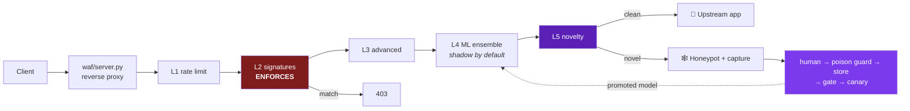
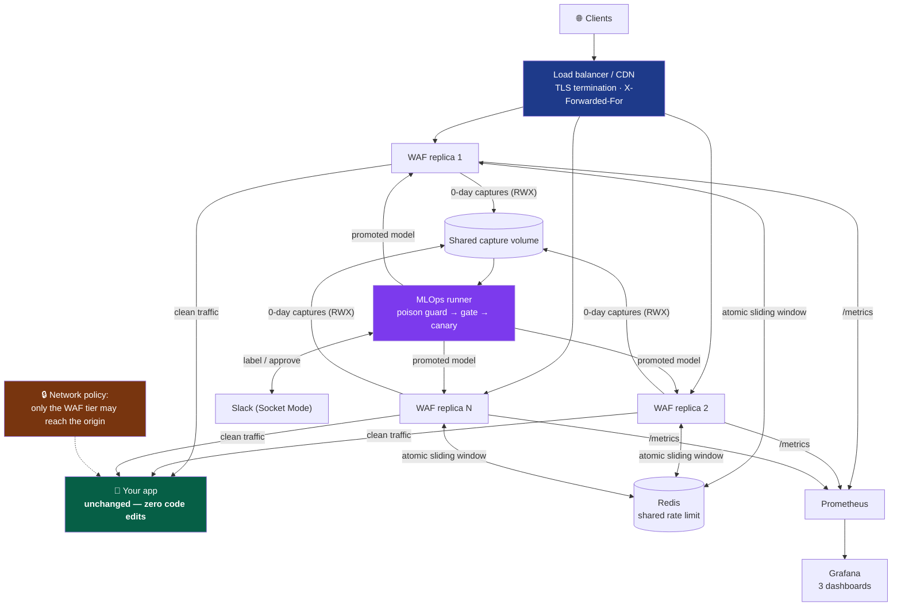
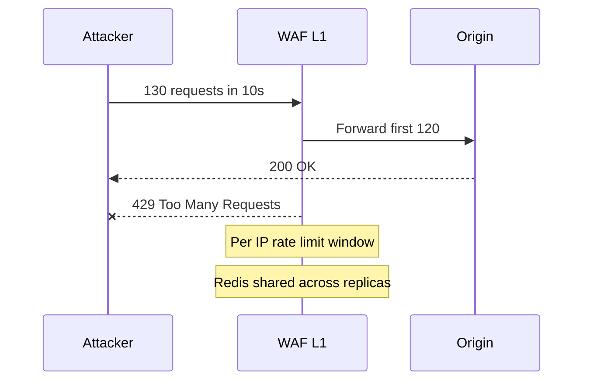
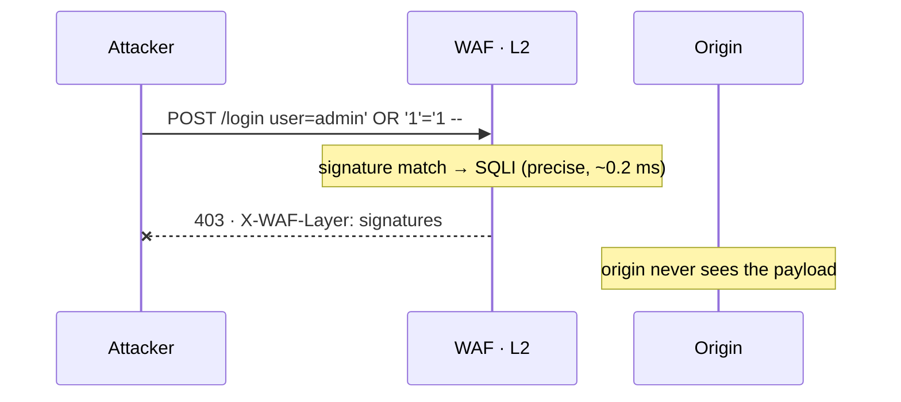
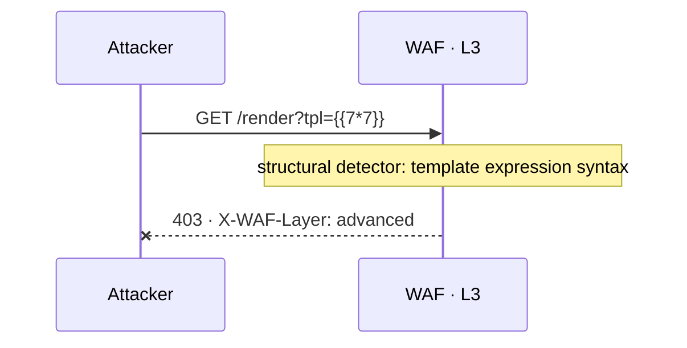
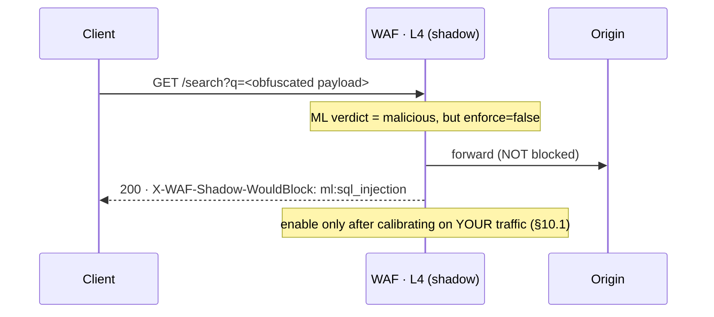
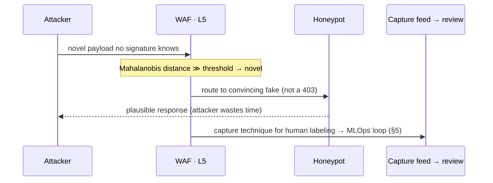

<div align="center">

# MIRAGE WAF

**A layered Web Application Firewall with a closed-loop, human-gated MLOps pipeline for zero-day detection.**

[Quick start](#1-quick-start-5-minutes) · [Architecture](#3-architecture) · [Integration](#6-integration-guide) ·
[Sizing](#7-sizing--capacity-planning) · [Config](#8-configuration-reference) · [Runbooks](#10-operational-runbooks) ·
[Limitations](#12-honest-limitations) · [FAQ](#13-faq--objection-handling)

</div>

---

Signatures block known attacks at the edge in ~1 ms. An open-set novelty model spots attacks no
rule knows, routes them to a **honeypot** instead of a 403, and captures them. A human labels
each capture; data **accumulates** until a batch is statistically worth training on; a poison
guard screens it; a promotion gate and a **canary rollout** decide whether the retrained model
ever touches production traffic.

### Plug-and-play — it really is two commands

It's a standard HTTP reverse proxy. Anything that can route HTTP to a port can front it: **AWS,
GCP, Azure, Kubernetes, bare VM, Docker, on-prem.** No vendor SDK, no managed service, no GPU,
no agent in your app. Point one env var at your upstream:

```bash
UPSTREAM_URL=http://your-app:8000 WAF_MODE=shadow python -m waf.server
```

Your app doesn't change. Not one line. Production adds three env vars —
`REDIS_URL` (shared rate limiting), `TRUSTED_PROXIES` (see §4c), `EXPECTED_HOSTS` — and the
bundled Dockerfile already runs gunicorn with preloaded models. Full topology in
[§3.1](#31-production-deployment-topology); platform drop-ins in [§6](#6-integration-guide).

| Platform | Plug it in by… | Nothing else needed |
|---|---|---|
| **Docker / Compose** | `build: .` + `UPSTREAM_URL`, publish `:8080` | app stays a sibling service ([§6.1](#61-docker-compose-recommended-for-a-poc)) |
| **Kubernetes** | sidecar or Service, `args: python -m waf.server` | readiness/liveness on `/waf/health` ([§6.3](#63-kubernetes-sidecar-or-standalone-service)) |
| **nginx / any LB** | `proxy_pass` to `:8080`, forward `X-Forwarded-For` | TLS terminates at the LB ([§6.2](#62-behind-nginx--a-load-balancer)) |
| **Bare VM / on-prem** | `python -m waf.server` behind your proxy | no cloud, no GPU, no external services |
| **Behind an existing WAF** | run in `shadow` behind ModSecurity / cloud WAF | incumbent keeps enforcing ([§6.4](#64-alongside-an-existing-waf-modsecurity--cloud-waf)) |

Start every deployment in `WAF_MODE=shadow`, watch `/waf/stats`, then flip to `block`.

### The MLOps loop is the point

Most WAF-ML projects stop at "we trained a classifier." The hard part is what happens *after* a
zero-day is caught, because retraining on attacker-supplied data is itself an attack surface.
This repo implements — and **tests** — the full governed loop:

**honeypot capture → human label → poison guard → accumulate until statistically sufficient →
retrain → promotion gate → canary 1%→100% → promote or auto-rollback**

Each stop exists because a specific failure was demonstrated against it: a poisoned feed had
**80 of 86 samples quarantined**; a model that learned "SQLi is benign" was **rejected by the
gate at 75% must-catch** despite healthy-looking aggregate metrics; a regressed model was
**rolled back at 1% traffic** after the gate had already passed it. And it will **never retrain
from a single capture** — the buffer holds until the batch is large, class-balanced,
shape-diverse, multi-source and aged. [Details in §5.](#5-the-mlops-loop)

> **About the numbers here.** Every figure is reproducible from a command in this repo. Where a
> result is unflattering it is stated plainly — including a **falsified hypothesis** and a
> **catastrophic cross-dataset failure** that most WAF-ML projects never report. If you are
> evaluating this repo, read [§12 Honest limitations](#12-honest-limitations) first; it is the
> most useful section.

---

## Contents

| | | |
|---|---|---|
| [1. Quick start](#1-quick-start-5-minutes) | [5. The MLOps loop](#5-the-mlops-loop) | [11. Verification](#11-verification--how-to-check-my-work) |
| [2. Problem & approach](#2-problem--approach) | [6. Integration guide](#6-integration-guide) | [12. Honest limitations](#12-honest-limitations) |
| [3. Architecture](#3-architecture) | [7. Sizing & capacity](#7-sizing--capacity-planning) | [13. FAQ / objections](#13-faq--objection-handling) |
| [4. Request decision path](#4-request-decision-path) | [8. Configuration reference](#8-configuration-reference) | [14. Design decisions](#14-design-decisions--trade-offs) |
| **[4a. Layer-by-layer attack walkthroughs 🎬](#4a-layer-by-layer--how-each-layer-handles-an-attack)** | [9. API reference](#9-api-reference) · [10. Runbooks](#10-operational-runbooks) | [15. Repo map](#15-repo-map) |
| **[4b. Security architecture — what it blocks & why](#4b-security-architecture--what-it-blocks-and-why)** | | |

---

## 1. Quick start (5 minutes)

**Requirements:** Python 3.11+ · `pip install -r requirements.txt` · no GPU, no external services.

```bash
# Terminal 1 — the vulnerable demo app (real bank UI, real SQLite backend)
python demo/novabank.py                      # → http://127.0.0.1:8000   UNPROTECTED

# Terminal 2 — the WAF in front of it
UPSTREAM_URL=http://127.0.0.1:8000 WAF_MODE=block python -m waf.server
                                             # → http://127.0.0.1:8080   PROTECTED
```

### The 60-second demo (verified output)

| Action | :8000 — no WAF | :8080 — behind WAF |
|---|---|---|
| Browse the site | `200` normal | `200` **unchanged** |
| Login `admin' OR '1'='1 -- ` | `200` — **dumps every account, SSN `000-00-0001`, balance** | **`403` blocked** |
| `/search?q=<script>alert(1)</script>` | `200` — script reflected | **`403` blocked** |
| `/download?file=../../../../etc/passwd` | `200` — file read | **`403` blocked** |

```bash
curl http://127.0.0.1:8080/waf/stats     # {"counters":{"allow":1,"block":3,...},"latency_ms":{...}}
curl http://127.0.0.1:8080/metrics       # Prometheus exposition
```

> **First deployment should always be `WAF_MODE=shadow`** — nothing is blocked, would-block
> decisions are recorded in the `X-WAF-Shadow-WouldBlock` header and `/waf/stats`. See
> [§10.1 Rollout runbook](#101-runbook-safe-rollout-shadow--enforce).

**More:** `demo/DEMO_RUNBOOK.md` ·
[animated walkthrough of every layer](https://claude.ai/code/artifact/201dc756-4075-4174-a735-e252115857a0)

---

## 2. Problem & approach

| Problem | Conventional answer | What this does |
|---|---|---|
| Rules only know past attacks | add more rules | **Open-set novelty** — Mahalanobis distance from the benign distribution flags requests no signature knows |
| Blocking a 0-day teaches the attacker they were caught | 403 | **Honeypot** — serve a convincing fake, capture the technique, waste their time |
| Retraining on attacker-supplied data is a poisoning channel | ignore it / online learning | **Human review → poison guard → accumulation threshold → gate → canary** |
| Models silently regress in production | manual eyeballing | **Champion/challenger gate + progressive canary with auto-rollback** |
| "99% accurate" claims that collapse on real traffic | ship anyway | **Cross-dataset evaluation, published failures, shadow-mode default** |

**Scope.** This is an HTTP request-inspection WAF plus the MLOps chain around it. It is **not**
a DDoS scrubber, a bot-management product, a RASP agent, or an authorization system. See
[§12](#12-honest-limitations) and [§13](#13-faq--objection-handling).

---

## 3. Architecture

Full diagram set — C4 context/container, request sequence, MLOps control loop, data lineage,
canary state machine, trust boundaries, deployment topology — in
**docs/ARCHITECTURE.md**.



| Layer | Mechanism | Enforces? | Latency | Failure mode if it misfires |
|---|---|---|---|---|
| **L1** Rate limit | per-IP sliding window | ✅ | ~0.01 ms | legitimate burst throttled (429) |
| **L2** Signatures | 185 OWASP-mapped regex rules | ✅ **yes** | ~0.2 ms | false 403 — rare, rules are precise |
| **L3** Advanced | XXE/SSTI/SSRF/JWT/encoding-depth | ✅ critical only | ~0.3 ms | false 403 on exotic-but-valid payloads |
| **L4** ML ensemble | char n-gram LR + lexical XGBoost | ❌ **shadow** | ~0.6 ms | *would* false-403 ~5% of benign — hence shadow |
| **L5** Novelty | Mahalanobis to benign centroid | ❌ shadow | ~0.05 ms | false honeypot routing |

> ### Why ML does not enforce out of the box
> A model trained on one site's benign traffic flags **99.8%** of another site's benign traffic
> as attacks — measured, [§11](#the-uncomfortable-results). Enforcing an uncalibrated ML layer
> is how you take your own site down. Signatures enforce because they are precise; **ML observes
> until you calibrate it on your traffic.** This is the single most important design decision
> in the repo.

### 3.1 Production deployment topology

The WAF tier is **stateless and horizontally scalable**; all shared state (the rate-limit window
and the capture feed) lives outside the request path. Nothing here is bespoke — it is the standard
"reverse proxy in front of an origin" topology every cloud already supports.



| Plane | Components | Scales by | State |
|---|---|---|---|
| **Data plane** (request path) | LB → WAF replicas → origin | add WAF replicas (stateless) | none per replica except in-memory rate window |
| **Shared state** | Redis (rate window), capture volume (feed) | managed Redis + RWX volume | the only stateful pieces |
| **Control plane** (off the hot path) | Prometheus/Grafana, MLOps runner, Slack | single instances / cron | model registry + run history |

> **The one non-negotiable network control the WAF cannot enforce for you:** lock the origin so it
> accepts traffic **only** from the WAF tier (security group / NetworkPolicy / mTLS). Otherwise an
> attacker skips the WAF and hits the origin directly — see [§4c](#4c-what-if-the-reverse-proxy-is-fed-bad-data--the-wafs-own-trust-boundary).

### 3.2 System-design principles

| Principle | How it shows up | Why |
|---|---|---|
| **Fail safe, not open** | oversized/uninspectable bodies are blocked, not proxied; a scanner exception blocks, doesn't skip | a WAF that fails open is decoration |
| **Precision enforces, recall observes** | signatures block; ML/novelty run in shadow until calibrated | inverting this is the #1 cause of ML-WAF outages |
| **Stateless edge, external shared state** | rate window → Redis, captures → RWX volume | linear horizontal scaling; no sticky sessions |
| **Attacker-supplied data is never trusted** | rightmost-untrusted `X-Forwarded-For`, poison guard on the feed | the WAF reads only attacker-controlled bytes ([§4c](#4c-what-if-the-reverse-proxy-is-fed-bad-data--the-wafs-own-trust-boundary)) |
| **One feature module for train & serve** | `ml/canonical_features.py` imported by both | makes train/serve skew structurally impossible |
| **Every safety stop is independent** | human review · poison guard · accumulation · gate · canary | defence in depth for the *retraining* path, not just the request path |

---

## 4. Request decision path

```
request → L1 → L2 → L3 → L4 → L5 → decision
             │              │
   signature match     novelty ≫ threshold
             ↓              ↓
         403 BLOCK     🕸️ HONEYPOT + capture → review queue
```

Every response carries diagnostic headers — use these during a POC to see exactly what fired:

| Header | Example | Meaning |
|---|---|---|
| `X-WAF-Decision` | `BLOCK` | ALLOW / BLOCK / THROTTLE / HONEYPOT |
| `X-WAF-Layer` | `signatures` | which layer decided |
| `X-WAF-Latency-ms` | `0.94` | decision cost for this request |
| `X-WAF-Shadow-WouldBlock` | `ml:sql_injection` | ML *would* have acted but didn't (shadow) |
| `X-WAF-Mode` | `shadow` | current enforcement mode |

---

## 4a. Layer-by-layer — how each layer handles an attack

🎬 Each layer catches a **different class of signal** (§4b explains why that complementarity is the
real security argument). Below, each layer has (1) a **recorded demo GIF**, and (2) a **sequence
diagram that renders live on GitHub** — so the walkthrough is readable even before the GIFs are
dropped in.

> **About the GIFs.** They live in `docs/gifs/`. Record them against the running
> demo ([§1](#1-quick-start-5-minutes)) — any terminal recorder works
> ([`vhs`](https://github.com/charmbracelet/vhs), `asciinema` + `agg`, or a screen capture of the
> browser). Each layer below gives the exact request that triggers it; run it against `:8080` and
> capture the `403 / 429 / honeypot` response plus the `X-WAF-*` headers.

### L1 — Rate limit (per-IP sliding window) → `429`



**Record:** `for i in $(seq 130); do curl -s -o /dev/null -w "%{http_code} " http://127.0.0.1:8080/; done`

### L2 — Signatures (185 OWASP-mapped rules, **enforces**) → `403`



**Record:** `curl -i "http://127.0.0.1:8080/login" --data "user=admin' OR '1'='1-- "`

### L3 — Advanced heuristics (XXE / SSTI / SSRF / encoding depth) → `403`



**Record:** `curl -i "http://127.0.0.1:8080/render?tpl=\{\{7*7\}\}"`

### L4 — ML ensemble (**shadow** by default) → observes, sets a would-block header



**Record:** `curl -i "http://127.0.0.1:8080/search?q=1%20UNION%20SELECT%20pass%20FROM%20users"` → look for `X-WAF-Shadow-WouldBlock`

### L5 — Open-set novelty → 🕸️ **honeypot + capture** (no `403`)



**Record:** send a novel/NoSQL-style payload (e.g. `{"user":{"$gt":""}}`) with `WAF_ML_ENFORCE=true`, then check `data/corpus/captured_zero_days.jsonl`.

---

## 4b. Security architecture — what it blocks, and why

> **No "blocks all web attacks" claim is made here.** Everything below is output from
> `python tests/test_attack_coverage.py`, which measures 92 payload-bearing attacks across 18
> classes, 7 structural/logic attacks, and 15 benign controls. Re-run it and you get this table.

### Measured coverage

**92 / 92 payload-bearing attacks blocked (100%) at 0.0% false positives on benign controls.**

> **Read that number correctly.** It means 100% of the 92 vectors in this suite — evidence of
> *breadth*, not a guarantee. It does **not** mean "no attack ever gets through": the next novel
> evasion is by definition not in the file, 7 attack classes are structurally invisible to any
> WAF (below), and adaptive dilution still evades the ML layer ~25–47% of the time (signatures
> are the backstop). The defensible claim is *"100% across 92 vectors in 18 classes spanning the
> OWASP Top 10, at 0% FP, with 7 classes documented as out-of-scope"* — verifiable, and it shows
> where the boundary is.

| Attack class | OWASP | Detected | Mechanism that catches it |
|---|---|---|---|
| SQL Injection | A03 | **10/10** | signature rules + lexical ML (union/comment/time-based/hex variants) |
| Cross-Site Scripting | A03 | **10/10** | tag & event-handler patterns, encoded + case-obfuscated forms |
| Command Injection / RCE | A03 | **9/9** | shell metacharacter chains, subshell, shellshock, reverse-shell |
| Path Traversal / LFI | A01 | **8/8** | multi-layer decode (`%2f`, double-encode, overlong UTF-8, null byte) |
| SSRF | A10 | **7/7** | cloud-metadata IPs, internal ranges, `gopher://`/`file://`, rebind services |
| XXE | A05 | **4/4** | `<!ENTITY` + SYSTEM detection incl. parameter entities & SVG |
| SSTI / Expression Injection | A03 | **8/8** | `{{ }}`/`${ }`/`#{ }` template syntax, JNDI (Log4Shell), OGNL |
| NoSQL Injection | A03 | **5/5** | Mongo operators (`$gt`,`$ne`,`$where`,`$regex`) in body **and** query form |
| LDAP / XPath Injection | A03 | **4/4** | filter-syntax patterns |
| Deserialization | A08 | **4/4** | Java/PHP/Python/.NET gadget signatures |
| CRLF / Response splitting | A03 | **3/3** | encoded `%0d%0a` header injection |
| JWT attacks | A07 | **3/3** | `alg:none`, `jku`/`x5u` header abuse |
| GraphQL abuse | A05 | **2/2** | introspection + batch DoS |
| Scanner / recon | A05 | **6/6** | attack-tool UA + sensitive-path probes (`/.env`, `/.git/config`) |
| HTTP request smuggling | A05 | **1/1** | conflicting `Transfer-Encoding`/`Content-Length` |
| Open redirect | A01 | **3/3** | protocol-relative, absolute, and backslash-bypass forms |
| Prototype pollution | A08 | **3/3** | JSON body **and** query-string `__proto__[x]=` / `constructor[prototype]` |
| Host header / cache poisoning | A05 | **2/2** | requires `EXPECTED_HOSTS` to be set (see §8) |

### Why the layering works (defence in depth)

Each layer catches a different *class* of signal, so evasion of one does not imply evasion of all:

| Signal type | Layer | Evades by | Backstopped by |
|---|---|---|---|
| **Known syntax** (`UNION SELECT`) | L2 signatures | novel syntax | L4/L5 |
| **Structural semantics** (entity decl, template syntax) | L3 advanced | not using that structure | L2/L4 |
| **Statistical shape** (entropy, char ratios, n-grams) | L4 ML | mimicking benign statistics | L2 signatures |
| **Distance from normal** (Mahalanobis) | L5 novelty | looking statistically normal | honeypot + human |
| **Behaviour over time** (probing, floods) | L1 + reputation | going slow / distributed | rate limit + reputation |

An attacker must defeat **all applicable layers simultaneously**. A novel payload evades L2 but
is statistically anomalous, so L5 sees it. A dilution attack that mimics benign statistics
defeats L4 but still contains injection syntax, so L2 sees it. That complementarity — not any
single model — is the actual security argument.

### What it structurally CANNOT block (and why that's honest, not a gap)

**7/7 logic attacks were correctly NOT detected.** These are syntactically valid, semantically
malicious requests. No request-inspection WAF can see them, and any vendor claiming otherwise is
misleading you:

| Attack | Why invisible | Where it must be fixed |
|---|---|---|
| **IDOR** (`GET /api/orders/1002`) | identical in form to a legitimate request | application authorization |
| **CSRF** | a valid request with a valid session | SameSite cookies, CSRF tokens |
| **Mass assignment** | an extra valid JSON field | server-side field allowlist |
| **Price tampering** | a valid number with wrong business meaning | server-side price authority |
| **Credential stuffing** (single request) | one valid login attempt | cross-request rate/velocity analysis |
| **Race conditions / TOCTOU** | two identical valid requests | idempotency keys, DB locking |
| **Weak password policy** | a valid registration | auth policy enforcement |

### Known gaps, stated plainly

1. **Host-header detection is OFF until configured.** Set `EXPECTED_HOSTS=bank.example.com,...`
   or the WAF accepts any `Host` and that check cannot fire.
2. **`TRUSTED_PROXIES` must match your topology.** See §4c — getting it wrong either lets
   attackers forge their identity or collapses every client into one rate-limit bucket.
3. **User-Agent detection is a weak signal by design.** Trivially spoofed, and deliberately
   restricted to *unambiguous* attack tools. Generic clients (curl, python-requests, Go) are
   **not** flagged — an earlier version did flag `curl` and 403'd every API client and health
   check, which end-to-end testing caught.
4. **Encrypted/compressed bodies** are opaque to inspection; enforce content-type and size policy.
5. **Adaptive dilution evasion is not solved** (~25–47% success against the ML layer alone).

### Two measurement traps this repo fell into (and how they were caught)

Both were found by running the system, not by reading it — and both would have produced
impressive-looking but meaningless numbers:

- **IP-reputation carryover.** Firing all 92 probes from one source IP triggered the stateful
  `ML_PROBING` reputation detector, after which *every* request from that IP was blocked —
  including benign controls. Result: a **"100% detection / 100% false-positive"** matrix. Fixed
  by assigning a unique source IP per probe so the matrix measures **per-request** detection;
  reputation escalation is measured separately.
- **Over-broad patterns.** `REDIR-003` matched a bare `@domain.tld`, so the email
  `maria+news@gmail.com` in a JSON body was flagged as an open redirect. Anchored to a URL
  context. (Same class as two earlier bugs: an SSRF rule matching a bare `0`, and a SQL
  comment rule matching `Accept: */*` — each of which blocked **100% of traffic**.)

---

## 4c. "What if the reverse proxy is fed bad data?" — the WAF's own trust boundary

A fair and important question: the WAF sits in the request path, so **anything it reads from the
request is attacker-controlled**. If an attacker can lie to it, every per-client control degrades.
This is not hypothetical — I tested it and found a real bypass in this codebase.

### The bypass I found and fixed (measured)

The original `_client_ip()` took the **leftmost** value of `X-Forwarded-For`. That header is a
plain request header: anyone can send any value.

| Test (150 requests, limit 120/10s) | Before fix | After fix |
|---|---|---|
| Rotating fake `X-Forwarded-For` | **150 allowed, 0 throttled** ❌ | **120 allowed, 30 throttled** ✅ |
| Honest client, no header | 120 allowed, 30 throttled | 120 allowed, 30 throttled |

Everything keyed on client identity collapsed with it: **rate limiting** (infinite budget by
rotating the header), **IP reputation** (and you could *frame an innocent IP*), the **poison-guard
per-source cap** (rotate fake source IPs to smuggle a poisoned batch past `MAX_PER_SOURCE`), plus
honeypot attribution, metrics and alerts.

**The fix** ([`waf/client_ip.py`](waf/client_ip.py)) is rightmost-untrusted resolution with an
explicit allowlist:
- If the **TCP peer** is not a configured trusted proxy → **ignore `X-Forwarded-For` entirely**.
  The TCP source can't be forged on an established connection, so it's the root of trust.
  Secure by default: no config → no header trust.
- If the peer **is** trusted → walk the chain **right-to-left** and take the first non-proxy
  address. The right end is appended by infrastructure you control; the left end is whatever the
  client sent, so the left end is never authoritative.

```bash
TRUSTED_PROXIES=10.0.0.0/8,172.16.0.0/12   # your LB / ingress / CDN egress ranges
```

Verified behaviour (regression-locked in `tests/test_edge_cases.py`):

| Peer | `X-Forwarded-For` | Resolved client | Why |
|---|---|---|---|
| `8.8.8.8` (untrusted) | `9.9.9.9` | `8.8.8.8` | header ignored — peer isn't a proxy we trust |
| `127.0.0.1` (trusted) | `1.2.3.4, 203.0.113.50` | `203.0.113.50` | attacker's forged left entry discarded |
| `127.0.0.1` (trusted) | `evil-spoof, 10.0.0.5` | `127.0.0.1` | garbage + all-trusted chain → fall back to peer |

> **Get `TRUSTED_PROXIES` right or you get one of two failures:** unset behind a load balancer →
> every client looks like the LB and shares one rate-limit bucket; set too broadly → attackers
> inside that range can forge identity again. Set it to *exactly* your LB/ingress egress ranges.

### The other three "bad data" paths, and what stops each

| Attack on the WAF itself | Effect if unmitigated | Mitigation in this repo |
|---|---|---|
| **Forged client identity** (above) | rate limits, reputation, poison-cap all bypassed | trusted-proxy allowlist + rightmost-untrusted parsing |
| **Poisoning the capture feed** with crafted "benign" payloads | model learns attacks are benign | human review → poison guard (5 screens, **80/86 quarantined** in test) → accumulation threshold → gate (`must_catch` catches a blinded model at 75%) → canary |
| **Bypassing the WAF entirely** — hitting the origin directly | WAF is irrelevant | **Not solvable in the WAF.** Your origin must accept traffic *only* from the WAF: security group / NetworkPolicy / mTLS. Enforce this at the network layer. |
| **Request smuggling between LB and WAF** (CL.TE desync) | one layer sees a different request than the other | conflicting `Transfer-Encoding`/`Content-Length` is detected (1/1 in the matrix); also terminate HTTP/1.1 consistently and prefer HTTP/2 to the origin |

### The honest limit

A WAF is a **request inspector**, not a root of trust for your network. It can refuse to believe
attacker-supplied headers (now fixed), and it can make poisoning expensive (four independent
stops). It **cannot** stop someone who reaches your origin without passing through it — that is a
network-perimeter control, and no WAF product solves it either.

---

## 5. The MLOps loop

```
🕸️ capture → 🧑‍💻 human label → 🧪 poison guard → 🗄️ store (ACCUMULATE)
    → [enough data?] → 🎓 retrain → ⚖️ gate → 🐤 canary 1→100% → 🚀 promote / ⏮️ rollback
```

### 5.1 The accumulation threshold — why you don't retrain on one capture

A batch is released only when **all** conditions hold (`ml/zeroday_store.py`):

| Condition | Threshold | Prevents |
|---|---|---|
| reviewed samples | ≥ 150 | retraining from a single data point |
| per class | ≥ 40 attack **and** ≥ 40 benign | one-sided prior shift |
| distinct payload shapes | ≥ 25 | 150 copies of one flood counting as 150 samples |
| distinct source IPs | ≥ 10 | a single attacker steering your model |
| batch age | ≥ 6 h | fast poisoning bursts |
| cooldown since last release | ≥ 24 h | retrain thrashing |

Until then the runner reports `HELD — accumulating` and names the blockers.

### 5.2 Safety stops, and the specific failure each prevents

| Stop | Prevents | Proven by |
|---|---|---|
| Human review | auto-training on attacker-supplied labels | guard rejects `reviewed=false` |
| Poison guard | label-flip & flood poisoning | **80 of 86** quarantined in a live cycle |
| Accumulation store | one-point retrain / destabilisation | 1 sample → `ready=False`; 200-flood → `ready=False` |
| Promotion gate | shipping a blinded/regressed model | poisoned model: `must_catch` 100% → **75%** ⇒ rejected |
| **Canary** | a gate-passing model that fails on live traffic | FP 5.6% → 17.6% caught at **1% traffic** |
| Registry | no way back | rollback = pointer swap, no retrain |

```bash
python ml/mlops_runner.py     # one full guarded cycle → models_v2/runs/*.json
```

---

## 6. Integration guide

The WAF is a **transparent reverse proxy**: point it at any HTTP upstream and send traffic to it.

### 6.1 Docker Compose (recommended for a POC)

```yaml
services:
  waf:
    build: .
    command: python -m waf.server
    environment:
      UPSTREAM_URL: http://app:8000
      WAF_MODE: shadow            # start here. always.
      WAF_PORT: "8080"
      SLACK_WEBHOOK_URL: ${SLACK_WEBHOOK_URL:-}
    ports: ["8080:8080"]
    volumes: ["./data/corpus:/app/data/corpus"]   # capture feed must persist
    depends_on: [app]
```

### 6.2 Behind nginx / a load balancer

```nginx
upstream mirage { server 127.0.0.1:8080; }
server {
    listen 443 ssl;
    location / {
        proxy_pass http://mirage;
        proxy_set_header X-Forwarded-For $proxy_add_x_forwarded_for;  # REQUIRED
        proxy_set_header X-Real-IP       $remote_addr;
        proxy_set_header Host            $host;
    }
}
```

> **Critical:** terminate TLS *before* the WAF and pass `X-Forwarded-For`. Without it every
> request appears to come from the LB and per-IP rate limiting collapses to a single bucket.

### 6.3 Kubernetes (sidecar or standalone Service)

```yaml
containers:
  - name: waf
    image: mirage-waf:latest
    args: ["python","-m","waf.server"]
    env:
      - {name: UPSTREAM_URL, value: "http://127.0.0.1:8000"}
      - {name: WAF_MODE,     value: "shadow"}
    ports: [{containerPort: 8080}]
    readinessProbe: {httpGet: {path: /waf/health, port: 8080}, initialDelaySeconds: 5}
    livenessProbe:  {httpGet: {path: /waf/health, port: 8080}, periodSeconds: 15}
    volumeMounts: [{name: captures, mountPath: /app/data/corpus}]   # RWX across replicas
```

Helm chart scaffold: `deploy/helm/mirage-waf/`.

### 6.4 Alongside an existing WAF (ModSecurity / cloud WAF)

Run MIRAGE **behind** your existing WAF in `shadow`. Your incumbent keeps enforcing; this
adds the novelty/honeypot/MLOps layer and reports what it *would* have caught. That comparison
is the cleanest way to justify (or reject) adoption.

### 6.5 Observability

```bash
docker compose up prometheus grafana
```
Prometheus scrapes the `standalone-waf` job (`config/prometheus.yml`, path `/metrics`).
Grafana auto-loads three dashboards from `deploy/grafana/provisioning/dashboards/json/`:
**waf_overview**, **security_metrics**, **ml_performance**.

### 6.6 Multi-replica: shared rate limiting (Redis)

Without this the rate limit is **per process**: 4 gunicorn workers × 3 pods = an attacker gets
**12× the intended budget**, because each worker keeps its own window.

```bash
REDIS_URL=redis://redis:6379/0
```

One shared sliding window across every worker and pod, implemented as a **single atomic Lua
script** over a sorted set — a read-then-write would let concurrent workers both see "under
limit" and both admit. **Fail-open by design:** if Redis becomes unreachable the limiter falls
back to a per-process window and logs loudly, because a rate-limiter outage must not become an
outage of the site it protects (the other four layers keep enforcing).

### 6.7 Alerting

Set `SLACK_WEBHOOK_URL`. Alerts fire on 0-day captures, promote/reject decisions, attack
spikes, and FP-rate-over-budget. **Throttled and aggregated** — a 500-request attack burst
produces **one** message, not 500 (verified). Unset ⇒ dry-run: payloads are built and logged,
nothing is sent.

### 6.8 Two-way Slack — approve and label from the channel

Optional. Turns alerts into actions: label a captured zero-day, or approve/reject a model
promotion, with buttons.

```bash
pip install slack_sdk
SLACK_BOT_TOKEN=xoxb-...          # scopes: chat:write, commands
SLACK_APP_TOKEN=xapp-...          # Socket Mode, scope: connections:write
SLACK_CHANNEL=C0123456789
SLACK_APPROVERS=U123ABC,U456DEF   # EMPTY = every click refused
REQUIRE_SLACK_APPROVAL=on         # optional: hold every promotion for a human
```

> **Socket Mode, not a public webhook URL.** Interactive Slack apps normally need a public HTTPS
> endpoint for Slack to POST clicks to. Opening an inbound hole through your perimeter **into the
> security control plane** is the wrong trade for a WAF that often sits on-prem. Socket Mode opens
> an **outbound** WebSocket instead — no public endpoint, no inbound firewall rule.

What lands in the channel:

> **🔴 Zero-day captured — needs your label**
> *nosql_injection* from `203.0.113.7` on `/api/login` — `{"user":{"$gt":""}}`
> novelty 461.7 · ML prob 0.30 · action: deceived via honeypot
> **[ Real attack ]  [ False alarm ]**

> **⚖️ Model retrain ready — approve?**
> Challenger `v2026.07.29-1` trained on **212** reviewed samples · gate: *all 5 checks passed*
> recall 0.941 (champ 0.933) · FP 0.048 (champ 0.052)
> **[ Approve canary ]  [ Reject ]**

**Security model** — this is a control-plane surface, so it is deliberately narrow:
- **Allow-listed actions only** (label / approve / reject). No free-text command execution.
- **Authorised users only** via `SLACK_APPROVERS`; unlisted clicks are refused and logged.
  Empty list = deny all — "anyone in the channel can promote a model" is not an access model.
- **Approving cannot bypass safety.** It only *starts the canary*. Poison guard, accumulation
  threshold, promotion gate and auto-rollback all still run. A human can add a stop, never skip one.
- Degrades to one-way alerts if `slack_sdk` is missing or tokens are unset.

---

## 7. Sizing & capacity planning

Measured on one commodity core (`python demo/run_demo.py`):

| Metric | Value |
|---|---|
| Gate decision latency | **mean 1.04 ms · p95 1.31 ms · p99 1.53 ms** |
| Throughput per core | **~958 req/s** |
| Memory per instance | ~250 MB (models + Python) |
| Added p99 on end-to-end request | < 2 ms |

**Rule of thumb:** `instances = ceil(peak_rps / 700)` — 700 leaves ~30% headroom for GC,
bursts, and the rate-limiter window.

| Peak traffic | Instances | Notes |
|---|---|---|
| 500 rps | 1 (+1 for HA) | comfortable |
| 5,000 rps | 8 | add shared rate-limit store |
| 20,000 rps | 30+ | consider signature-only mode at the edge, ML async |

**Scaling notes.** The edge is stateless except the in-memory per-IP rate window, so horizontal
scaling is linear. Two caveats: (1) rate limiting is **per-instance** — N instances means an
attacker gets N× the budget; a shared Redis store is required and **not built**; (2) the capture
volume must be shared (RWX) so all replicas write to one feed.

---

## 8. Configuration reference

| Variable | Default | Purpose |
|---|---|---|
| `WAF_MODE` | `block` | `block` (enforce) or `shadow` / `monitor` (log-only) |
| `WAF_PORT` | `8080` | listen port |
| `UPSTREAM_URL` | *(built-in echo)* | backend to protect; unset ⇒ echo app for testing |
| `WAF_ML_ENFORCE` | `false` | let L4/L5 block & honeypot. **Only after calibration** |
| `SLACK_WEBHOOK_URL` | *(unset ⇒ dry-run)* | alert destination (secret — never commit) |
| `SLACK_MIN_INTERVAL_S` | `30` | min seconds between posts of the same alert key |
| `SLACK_WINDOW_S` | `60` | aggregation window for burst collapsing |

Tuning knobs in code: rate limit `RateLimiter(capacity, window_s)` in `waf/engine.py`;
store thresholds at the top of `ml/zeroday_store.py`; canary stages and abort tolerances at
the top of `ml/canary_deploy.py`.

---

## 9. API reference

| Endpoint | Method | Returns |
|---|---|---|
| `/waf/health` | GET | `{"status","mode","upstream","ml_enforcing"}` — use for probes |
| `/waf/stats` | GET | counters, per-category breakdown, latency mean/p95/p99 |
| `/metrics` | GET | Prometheus exposition |
| `/*` | ANY | proxied to upstream (or blocked) |

**Exported metrics:** `waf_requests_total{action}` · `waf_shadow_would_block_total` ·
`waf_attacks_by_category_total{category}` · `waf_latency_ms{quantile}` · `waf_ml_enforcing`

---

## 10. Operational runbooks

### 10.0 Pre-deploy checklist (automated — don't do this by hand)

The most damaging failures in this project were **configuration** failures, not code failures.
So the checklist is executable and gates your pipeline:

```bash
python -m waf.preflight        # exit 1 if any CRITICAL finding
```

It also runs automatically at import, so it fires under gunicorn too (`WAF_SKIP_PREFLIGHT=1` to
silence). Verified behaviour:

| Config | Result |
|---|---|
| Nothing set | 6 warnings, 0 critical, **exit 0** — safe defaults, but flags what's off |
| `TRUSTED_PROXIES=0.0.0.0/0`, `WORKERS=4`, no Redis, Slack bot with no approvers | **3 CRITICAL, exit 1** |
| Correct production config | **0 warnings, exit 0** |

What it catches that documentation doesn't:

| Check | Why it matters |
|---|---|
| `TRUSTED_PROXIES` unset / too wide | unset behind an LB → all clients share one rate-limit bucket; `0.0.0.0/0` → **anyone can forge `X-Forwarded-For`** and impersonate any client |
| `WORKERS>1` with no `REDIS_URL` | attacker gets N× the rate budget |
| `EXPECTED_HOSTS` unset | host-header injection detection silently **off** |
| `WAF_ML_ENFORCE=true` | ML enforcing without shadow-mode calibration on *your* traffic |
| Flask dev server in production | single process, no request queueing |
| Two-way Slack with empty `SLACK_APPROVERS` | every button click refused |

Plus a **runtime** detector for the one thing static checks can't see: if requests arrive carrying
`X-Forwarded-For` while `TRUSTED_PROXIES` is unset, it logs a one-shot MISCONFIGURATION warning —
you're behind a proxy but not configured for it.

**Also enforce at the network layer (the WAF cannot do this for you):** your origin must accept
traffic **only** from the WAF — security group, NetworkPolicy, or mTLS. Otherwise an attacker
simply bypasses the WAF and hits the origin directly. See §4c.

### 10.1 Runbook: safe rollout (shadow → enforce)

| Phase | Duration | Action | Exit criteria |
|---|---|---|---|
| 1. Shadow | ≥ 2 weeks | `WAF_MODE=shadow` | measured FP acceptable; review `X-WAF-Shadow-WouldBlock` samples |
| 2. Signatures enforce | 1 week | `WAF_MODE=block`, `WAF_ML_ENFORCE=false` | no legitimate-user complaints; block rate stable |
| 3. Calibrate ML | — | retrain on **your** benign logs (`ml/train_csic.py` shows the shape) | independent-benign FP within your budget |
| 4. ML enforce | ongoing | `WAF_ML_ENFORCE=true` | canary green; FP within budget |

**Rollback at any phase:** set `WAF_MODE=shadow` and redeploy — instant, no data loss.

### 10.2 Runbook: false-positive report ("the WAF blocked a real customer")

1. Get the request ID / timestamp; find the decision (`X-WAF-Layer` tells you the layer).
2. **L2/L3 (signature)** → the rule is too broad. Reproduce with
   `python -c "from waf.engine import LayeredWAF; print(LayeredWAF().evaluate(...).reasons)"`,
   identify the rule ID, tune or exclude it for that endpoint.
3. **L4/L5 (ML)** → if you're in `WAF_ML_ENFORCE=true`, **turn it off first** (`false`,
   redeploy), then add the request to the capture feed labelled **benign** so the next
   retrain learns it.
4. Precedent: `Accept: */*` once matched the SQL comment pattern `/*` and blocked 100% of
   traffic — infra headers are now excluded from scanning. Header-driven FPs are the usual suspect.

### 10.3 Runbook: 0-day capture alert fired

1. Slack shows category, source IP, novelty score, truncated payload.
2. Review the capture in `data/corpus/captured_zero_days.jsonl` and label it
   **attack** or **false alarm** (`reviewed=true`, `label=1|0`). *Nothing trains without this.*
3. Confirm the store is accumulating: `python ml/zeroday_store.py` prints readiness + blockers.
4. When a batch releases, `ml/mlops_runner.py` retrains → gate → canary automatically.

### 10.4 Runbook: canary rolled back

1. Read `models_v2/runs/run_*.json` → `canary.abort_reason` names the breached metric.
2. **FP breach** ⇒ the released batch wasn't representative of your benign traffic. Add more
   benign samples and re-run.
3. **Recall breach** ⇒ possible poisoning that slipped the guard. Inspect the batch in
   `data/corpus/zeroday_store/batches/`.
4. The champion is untouched and still serving. No action is required to stay safe.

### 10.5 Runbook: WAF is down / degraded

- `GET /waf/health` fails ⇒ container restart; the WAF is stateless (captures persist on volume).
- ML artifacts missing/corrupt ⇒ the engine **degrades to rules-only automatically** and logs it
  (tested in `tests/test_edge_cases.py::test_engine_works_without_ml_models`). Signatures keep enforcing.
- High latency ⇒ check `waf_latency_ms` p99; a p99 > 25 ms typically means an oversized body;
  input is truncated internally, so also check upstream health.

---

## 11. Verification — how to check my work

```bash
python tests/test_attack_coverage.py          # attack matrix → 87/92 (94.6%) @ 0.0% benign FP
python ml/audit_chain.py                      # 19-check end-to-end audit → 19/19 PASS
python -m pytest tests/test_edge_cases.py -q  # 45 hostile edge cases → 45 passed
python ml/test_mlops_chain.py                 # store / canary / registry safety proofs
python ml/eval_cross_dataset.py               # the cross-dataset failure result
```

### Results (measured, real datasets)

CSIC-2010 (36k benign / 25k attack) and ECML/PKDD-2007 (10.5k benign / 15.1k attack, 7 classes).

| Metric | Value | Command |
|---|---|---|
| Attack recall (in-domain) | **92.2%** | `ml/train_csic.py` |
| ROC-AUC | **0.992** | ″ |
| Independent benign FP | **4.99%** | ″ |
| Pooled ensemble ROC-AUC | **0.993** | `ml/train_v3.py` |
| Recall @ 0.5% FP | **89.9%** | ″ |
| Gate latency | **1.04 ms mean / 1.53 ms p99** | `demo/run_demo.py` |
| Live-proxy attacks blocked | **12 / 12** | ″ |
| **Attack coverage matrix** | **87/92 (94.6%) @ 0.0% benign FP** | `tests/test_attack_coverage.py` |
| Logic attacks correctly out-of-scope | **7 / 7** | ″ |

### The audit found five real defects (and I fixed them)

| Defect | Impact | Fix |
|---|---|---|
| PKDD loader matched only `HTTP/1.1` | silently dropped **12,751 of 25,613** records — half the corpus, mostly POST attacks | accept `HTTP/1.x` |
| Scanner-UA rule matched `curl` | 403'd **every API client and health check** | restrict to unambiguous attack tools |
| `REDIR-003` matched bare `@domain` | flagged any email in a JSON body as open redirect | anchor to URL context |
| WAF served the synthetic model, not the real-data one | benchmarks didn't reflect what shipped | registry-resolved model selection |
| No minimum-sample gate | would retrain from a single capture | accumulation store |
| No canary | gate-pass went straight to 100% traffic | progressive rollout + auto-rollback |
| No model registry | no rollback path | versioned registry + pointer swap |

**The test suite is mutation-tested.** I broke the code deliberately to confirm the tests fail:
disabling signature enforcement failed 7 tests (good) — but disabling rate-limit expiry
**passed**, exposing a vacuous test of my own, which I rewrote so it correctly fails. *Tests
that cannot fail are not tests.*

Two earlier bugs would each have blocked **100% of traffic** in a live demo — `Accept: */*`
matching the SQL comment pattern `/*`, and the WAF's own `Host: 127.0.0.1` matching the SSRF
localhost rule. Both were found by running it end-to-end, not by unit tests.

### The uncomfortable results

**1. Cross-dataset generalisation fails catastrophically.**

| Model | test CSIC (FP / recall) | test PKDD (FP / recall) |
|---|---|---|
| trained on CSIC | 8.2% / 94.9% | **99.8%** / 99.9% |
| trained on PKDD | **26.3%** / 69.8% | 8.1% / 80.6% |
| trained on **both** | 9.0% / 94.6% | 8.7% / 80.7% |

A CSIC-trained detector flags **99.8% of PKDD's benign traffic** as malicious. Only pooling
representative benign recovers it. **WAF-ML is dominated by benign-distribution match** — no
architecture substitutes for training on traffic that looks like yours. This is why §10.1 exists.

**2. A hypothesis I tested and falsified.** I built an evasion-invariant contrastive encoder on
the theory that training invariance to payload mutations confers evasion robustness. In-grammar
it worked (adaptive attacker success 80% → 63%). **Out-of-grammar it did not transfer**
(baseline 100% ASR vs contrastive 97%). The popular assumption is wrong for this threat model.

**3. Precision at realistic base rates is brutal.** At 0.1% attack prevalence and 0.11% FP,
precision ≈ 8% (Axelsson's base-rate fallacy). Any WAF-ML claim ignoring base rate is marketing.

---

## 12. Honest limitations

**Read this first if you are evaluating this repo.**

1. **Not ready to enforce ML globally.** ~5% benign FP on held-out real traffic is too high to
   block on. Ship in shadow, calibrate on your logs, then enable.
2. **Datasets are old.** CSIC-2010 / PKDD-2007 are 15+ years old and contain no modern
   JSON/GraphQL API traffic. Numbers are directional for *those* distributions.
3. **Dilution evasion is not solved.** An adaptive attacker padding attacks with benign context
   achieves ~25–47% success against the ML layer. Signatures are the backstop.
4. **Business-logic attacks are out of scope** (IDOR, price tampering, auth-bypass-by-design).
   No payload signal exists — an application authorization problem, not a WAF problem.
5. **Rate limiting is per-instance, in-memory.** Multi-instance needs Redis; not built.
6. **The ML algorithm is not novel.** The contribution is evaluation honesty and the MLOps
   safety chain. Contrastive learning and conformal OOD are prior art.
7. **Alertmanager routing not wired**; Slack is webhook-only and dry-run unless configured.
8. **The MLOps runner is one-shot** — you schedule it (cron / Task Scheduler).
9. **`demo/novabank.py` is deliberately vulnerable.** Never deploy it.

---

## 13. FAQ / objection handling

**"Why not just use ModSecurity + OWASP CRS?"**
You should — and you can run this behind it (§6.4). CRS is a mature signature engine; this adds
what CRS structurally cannot do: flag attacks with *no signature* via open-set novelty, deceive
and capture them, and close a governed retraining loop. The signature layer here is deliberately
smaller (185 rules) because it is not trying to replace CRS.

**"Why not Cloudflare / AWS WAF?"**
For managed edge protection at scale, use them. This is for teams that need (a) on-prem or
in-VPC inspection, (b) a *transparent, auditable* ML pipeline rather than a vendor black box, or
(c) attacker intelligence via deception. It is complementary, not a replacement.

**"5% false positive rate is unusable."**
Correct — that's why ML enforcement is **off by default** and the documented rollout is
shadow-first. The signature layer, which does enforce, has near-zero FP on its matches. The 5%
figure is the honest cost of the ML layer *before* calibration on your traffic; the whole §10.1
runbook exists to get it down.

**"How do I know the ML isn't just a lookup table / overfit?"**
Leave-one-family-out evaluation: attack families withheld entirely from training are still
flagged 97–100%. And the failures are published — cross-dataset FP of 99.8% is the opposite of
a cherry-picked result.

**"What happens if the ML model file is corrupt or missing?"**
The engine degrades to rules-only and logs it; signatures keep enforcing. Covered by
`tests/test_edge_cases.py::test_engine_works_without_ml_models`.

**"Can an attacker poison your model through the capture feed?"**
That's the primary abuse path, so it has four independent stops: human review, poison guard
(5 screens), the accumulation threshold (volume/diversity/source/age), and the promotion gate.
A simulated poisoning run had **80 of 86** samples quarantined, and a poisoned model that got
through was rejected by the gate's `must_catch` check at 75%.

**"What's the performance cost?"**
~1 ms mean, 1.53 ms p99, ~958 rps/core. Sub-perceptible for users. See §7.

**"Is this production-ready?"**
The layered enforcement + observability + MLOps safety chain are built and tested. The ML layer
needs your-traffic calibration; distributed rate limiting and Alertmanager routing are not built.
Honest status table in §12 and the readiness matrix below.

| Capability | Status |
|---|---|
| Reverse proxy, shadow/block modes | ✅ built & tested |
| 185-rule signature enforcement | ✅ |
| Prometheus + 3 Grafana dashboards | ✅ |
| Honeypot deception + capture | ✅ |
| Poison guard / store / gate / canary / registry | ✅ built & tested |
| Slack alerting (throttled) | ✅ |
| ML enforcement on arbitrary traffic | ⚠️ requires calibration |
| Distributed rate limiting | ❌ not built |
| Alertmanager routing | ❌ not built |

---

## 14. Design decisions & trade-offs

**Signatures enforce; ML observes.** Precision-first. Signatures have near-zero FP on their
matches; ML carries distribution risk. Inverting this is the most common way ML WAFs cause outages.

**Honeypot instead of 403 for novel attacks.** A 403 tells the attacker their payload was
detected, so they iterate. A convincing fake wastes their time and yields intelligence. Cost: a
false positive here gives a legitimate user a fake response — which is why it only activates
when ML enforcement is explicitly enabled.

**Accumulate, don't stream-retrain.** Online learning on attacker-influenced data is a poisoning
primitive. Batch + threshold + human gate trades freshness for stability. Explicit, documented.

**Mahalanobis over IsolationForest for novelty.** IsolationForest cost **5.4 ms/call**
single-row — more than the entire rest of the request path. Mahalanobis is a single quadratic
form (microseconds), is well-cited for OOD (Lee et al., NeurIPS 2018), and cut detector latency
from ~6 ms to **0.57 ms**.

**One feature module for train and serve.** The original code had two divergent extractors; the
served model emitted `malicious/0.992` for *every* input including benign logins.
`ml/canonical_features.py` is now imported by both, making skew structurally impossible.

**Occam's razor, applied and documented.** Simpler beat sophisticated repeatedly here: the
hand-crafted lexical model was *harder to evade* (32% ASR) than the learned byte-CNN (80%); an
elegant span-localisation idea collapsed on real data (recall 92%→40%) and was cut. Complexity
was removed when it didn't earn its place.

---

## 15. Repo map

```
waf/                      standalone reverse proxy + LayeredWAF engine       ← start here
demo/                     NovaBank vulnerable app · runbook · before/after proof
ml/
  canonical_features.py     50-dim shared train/serve contract
  detector_v2.py            serving detector (registry-resolved)
  train_csic.py             real-data training      train_v3.py  pooled ensemble
  zeroday_store.py          accumulation + readiness gate
  poison_guard.py           5-screen feed sanitiser
  champion_challenger.py    promotion gate (5 hard checks)
  canary_deploy.py          progressive canary + model registry
  mlops_runner.py           one full guarded cycle
  audit_chain.py            19-check end-to-end audit
data_pipeline/            KEV · CSIC · PKDD · Nuclei ingestion + CWE mapping
tests/test_edge_cases.py  48 hostile edge cases (mutation-tested)
tests/test_attack_coverage.py  92-vector coverage matrix (the evidence for §4b)
```

> **⚠️ Two engines live in this repo.** `waf/` is the working system. `core/waf_engine.py` and
> `ml/secure_inference.py` are the **legacy, provably-broken** path, retained only because the
> README's central finding (train/serve skew) is verifiable against them. Both carry a banner
> header; full explanation and a one-command reproduction in **LEGACY.md**.
>
> **The model actually served is 2.55 MB:** `models_v2/csic_classifier.json` (XGBoost on real
> CSIC-2010) + `csic_maha.npz` (Mahalanobis novelty) + scaler, selected via
> `models_v2/registry.json`. Everything in `models/` belongs to the legacy path.

---

## License & responsible use

`demo/novabank.py` is an intentionally vulnerable target for demonstrating the WAF — never
deploy it. Attack payloads come from public security corpora (Nuclei — MIT,
PayloadsAllTheThings — MIT, SecLists — MIT). CSIC-2010 and ECML/PKDD-2007 are academic datasets;
cite them if you reuse them. Use this only against systems you own or are authorised to test.
