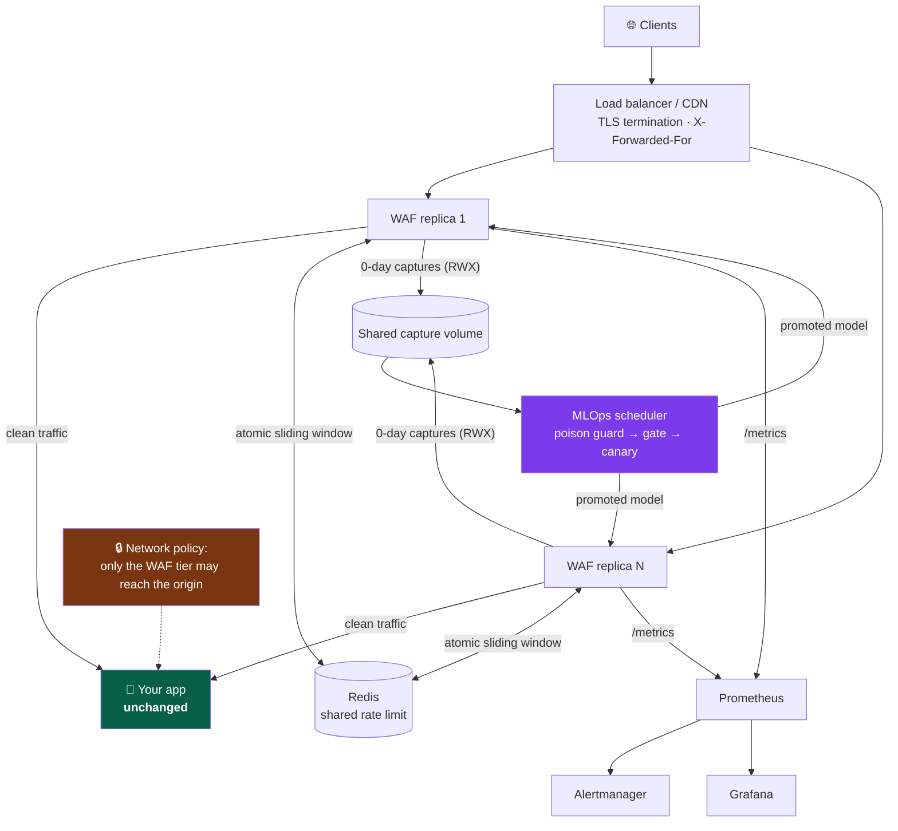
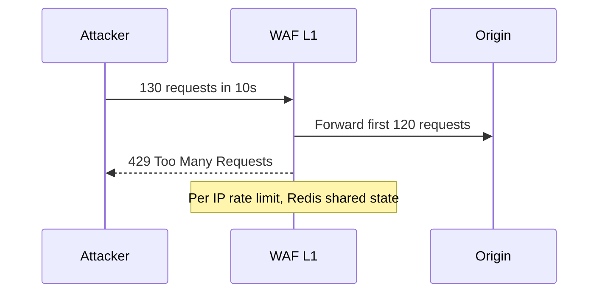
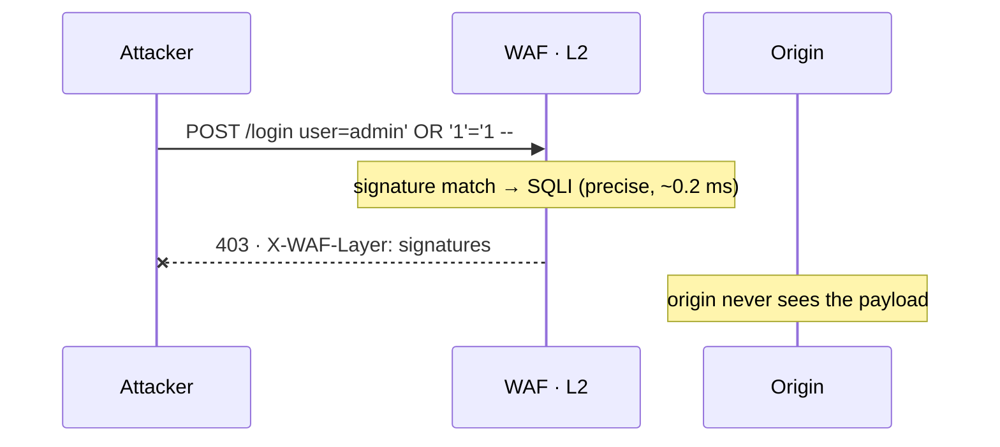
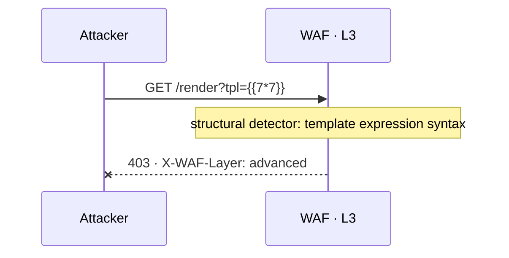
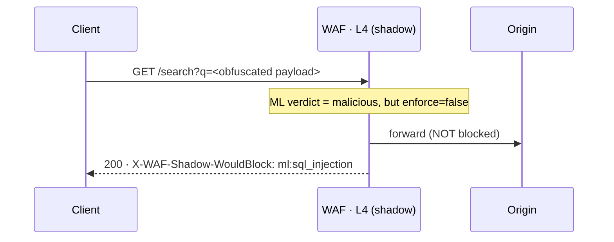

<div align="center">

# MIRAGE WAF

**A layered Web Application Firewall with a closed-loop, human-gated MLOps pipeline for zero-day detection.**

[Quick start](#quick-start) · [Architecture](#architecture) · [Per-layer walkthroughs](#how-each-layer-handles-an-attack) ·
[Coverage](#what-it-blocks-and-what-it-cannot) · [Integration](#integration) · [Config](#configuration) ·
[Limitations](#honest-limitations)

</div>

---

Signatures block known attacks at the edge in ~1 ms. An open-set novelty model spots attacks no
rule knows, routes them to a **honeypot** instead of a 403, and captures them. A human labels each
capture; data **accumulates** until a batch is statistically worth training on; a poison guard
screens it; a promotion gate and a **canary rollout** decide whether the retrained model ever
touches production traffic.

> **About the numbers.** Every figure here is reproducible from a command in this repo. Where a
> result is unflattering it is stated plainly — including a falsified hypothesis and a
> catastrophic cross-dataset failure. If you are evaluating this, read
> [Honest limitations](#honest-limitations) first; it is the most useful section.

## Plug-and-play — two commands

A standard HTTP reverse proxy. Anything that routes HTTP to a port can front it: AWS, GCP, Azure,
Kubernetes, bare VM, Docker, on-prem. No vendor SDK, no managed service, no GPU, no agent in your app.

```bash
UPSTREAM_URL=http://your-app:8000 WAF_MODE=shadow python -m waf.server
```

Your app doesn't change — not one line. Production adds three env vars: `REDIS_URL` (shared rate
limiting), `TRUSTED_PROXIES`, `EXPECTED_HOSTS`. The bundled Dockerfile runs gunicorn with preloaded models.

| Platform | Plug it in by… |
|---|---|
| **Docker / Compose** | `build: .` + `UPSTREAM_URL`, publish `:8080` |
| **Kubernetes** | sidecar or Service; readiness/liveness on `/waf/health` |
| **nginx / any LB** | `proxy_pass` to `:8080`, forward `X-Forwarded-For` |
| **Bare VM / on-prem** | `python -m waf.server` behind your proxy |
| **Behind an existing WAF** | run in `shadow`; your incumbent keeps enforcing |

Start every deployment in `WAF_MODE=shadow`, watch `/waf/stats`, then flip to `block`.

---

## Quick start

**Requirements:** Python 3.11+ · `pip install -r requirements.txt` · no GPU, no external services.

```bash
# Terminal 1 — the vulnerable demo app (real bank UI, real SQLite backend)
python demo/novabank.py                      # → http://127.0.0.1:8000   UNPROTECTED

# Terminal 2 — the WAF in front of it
UPSTREAM_URL=http://127.0.0.1:8000 WAF_MODE=block python -m waf.server
                                             # → http://127.0.0.1:8080   PROTECTED
```

| Action | :8000 — no WAF | :8080 — behind WAF |
|---|---|---|
| Browse the site | `200` normal | `200` **unchanged** |
| Login `admin' OR '1'='1 -- ` | `200` — **dumps every account, SSN, balance** | **`403` blocked** |
| `/search?q=<script>alert(1)</script>` | `200` — script reflected | **`403` blocked** |
| `/download?file=../../../../etc/passwd` | `200` — file read | **`403` blocked** |

```bash
curl http://127.0.0.1:8080/waf/stats     # counters, per-category, latency p95/p99
curl http://127.0.0.1:8080/metrics       # Prometheus exposition
```

Every response carries diagnostics — `X-WAF-Decision`, `X-WAF-Layer`, `X-WAF-Latency-ms`,
`X-WAF-Shadow-WouldBlock`, `X-WAF-Mode` — so a POC shows exactly what fired.

---

## Architecture


| Layer | Mechanism | Enforces? | Latency | Failure mode if it misfires |
|---|---|---|---|---|
| **L1** Rate limit | per-IP sliding window (Redis-shared) | ✅ | ~0.01 ms | legitimate burst throttled (429) |
| **L2** Signatures | 191 OWASP-mapped rules | ✅ **yes** | ~0.2 ms | false 403 — rare, rules are precise |
| **L3** Advanced | XXE/SSTI/SSRF/JWT/encoding-depth | ✅ critical only | ~0.3 ms | false 403 on exotic-but-valid payloads |
| **L4** ML | grammar-conformance + lexical models | ❌ **shadow** | ~0.6 ms | would false-403 until calibrated |
| **L5** Novelty | Mahalanobis to benign centroid | ❌ shadow | ~0.05 ms | false honeypot routing |

> ### Why ML does not enforce out of the box
> A model trained on one site's benign traffic flags **99.8%** of another site's benign traffic as
> attacks — measured, [below](#the-uncomfortable-results). Enforcing an uncalibrated ML layer is how
> you take your own site down. Signatures enforce because they are precise; **ML observes until you
> calibrate it on your traffic.** This is the single most important design decision in the repo.

### Deployment topology

The WAF tier is stateless and horizontally scalable; all shared state lives outside the request path.



**Design principles.** Fail *safe*, not open (uninspectable bodies are blocked, a scanner exception
blocks rather than skips). Precision enforces, recall observes. Stateless edge, external shared
state. Attacker-supplied data is never trusted. One feature module for train *and* serve, so skew
is structurally impossible. Every safety stop in the retrain path is independent.

---

## How each layer handles an attack

### L1 — Rate limit → `429`


### L2 — Signatures (**enforces**) → `403`


### L3 — Advanced heuristics → `403`


### L4 — ML (**shadow**) → observes, sets a would-block header


### L5 — Novelty → 🕸️ **honeypot + capture** (no `403`)


---

## What it blocks, and what it cannot

> Output of `python tests/test_attack_coverage.py`: 92 payload-bearing attacks across 18 classes,
> 7 structural/logic attacks, 15 benign controls. Re-run it and you get this table.

**92 / 92 payload-bearing attacks blocked (100%) at 0.0% false positives.**

> **Read that correctly.** It means 100% of the 92 vectors *in this suite* — evidence of breadth,
> not a guarantee. The next novel evasion is by definition not in the file, 7 attack classes are
> structurally invisible to any WAF, and adaptive dilution still evades the ML layer ~25–47% of the
> time (signatures are the backstop).

| Class | OWASP | Detected | Class | OWASP | Detected |
|---|---|---|---|---|---|
| SQL Injection | A03 | **10/10** | Deserialization | A08 | **4/4** |
| Cross-Site Scripting | A03 | **10/10** | CRLF / Response splitting | A03 | **3/3** |
| Command Injection / RCE | A03 | **9/9** | JWT attacks | A07 | **3/3** |
| Path Traversal / LFI | A01 | **8/8** | Open redirect | A01 | **3/3** |
| SSTI / Expression Injection | A03 | **8/8** | Prototype pollution | A08 | **3/3** |
| SSRF | A10 | **7/7** | GraphQL abuse | A05 | **2/2** |
| Scanner / recon | A05 | **6/6** | Host header / cache poisoning | A05 | **2/2** |
| NoSQL Injection | A03 | **5/5** | HTTP request smuggling | A05 | **1/1** |
| XXE | A05 | **4/4** | LDAP / XPath Injection | A03 | **4/4** |

**Why layering works.** Each layer catches a different *class* of signal, so evading one does not
imply evading all: known syntax (L2) → novel syntax evades it, but L4/L5 see the anomaly; statistical
shape (L4) → mimicking benign statistics evades it, but the payload still contains injection syntax
for L2. An attacker must defeat all applicable layers **simultaneously**. That complementarity — not
any single model — is the security argument.

### What it structurally CANNOT block

**7/7 logic attacks correctly NOT detected.** These are syntactically valid, semantically malicious
requests. No request-inspection WAF can see them, and any vendor claiming otherwise is misleading you:

| Attack | Why invisible | Fix belongs in |
|---|---|---|
| **IDOR** (`GET /api/orders/1002`) | identical in form to a legitimate request | application authorization |
| **CSRF** | a valid request with a valid session | SameSite cookies, CSRF tokens |
| **Mass assignment** | an extra valid JSON field | server-side field allowlist |
| **Price tampering** | a valid number, wrong business meaning | server-side price authority |
| **Credential stuffing** (single req) | one valid login attempt | cross-request velocity analysis |
| **Race conditions / TOCTOU** | two identical valid requests | idempotency keys, DB locking |
| **Weak password policy** | a valid registration | auth policy enforcement |

### The WAF's own trust boundary

Everything the WAF reads is attacker-controlled. The original `_client_ip()` took the **leftmost**
`X-Forwarded-For` value — a plain request header anyone can forge. Measured, 150 requests against a
120/10s limit:

| Test | Before fix | After fix |
|---|---|---|
| Rotating fake `X-Forwarded-For` | **150 allowed, 0 throttled** ❌ | **120 allowed, 30 throttled** ✅ |

Everything keyed on client identity collapsed with it: rate limiting, IP reputation (you could
*frame an innocent IP*), and the poison-guard per-source cap. The fix (`waf/client_ip.py`) is
rightmost-untrusted resolution: if the TCP peer isn't a configured trusted proxy, `X-Forwarded-For`
is **ignored entirely**; if it is, walk the chain right-to-left.

```bash
TRUSTED_PROXIES=10.0.0.0/8,172.16.0.0/12   # your LB / ingress / CDN egress ranges
```

> **Get this right or you get one of two failures:** unset behind a load balancer → every client
> shares one rate-limit bucket; set too broadly → attackers inside that range forge identity again.

**The honest limit:** a WAF is a request inspector, not a network root of trust. It cannot stop
someone who reaches your origin *without passing through it* — enforce that with a security group,
NetworkPolicy, or mTLS. No WAF product solves this either.

---

## The MLOps loop

```
🕸️ capture → 🧑‍💻 human label → 🧪 poison guard → 🗄️ store (ACCUMULATE)
    → [enough data?] → 🎓 retrain → ⚖️ gate → 🐤 canary 1→100% → 🚀 promote / ⏮️ rollback
```

Most WAF-ML projects stop at "we trained a classifier." The hard part is what happens *after* a
zero-day is caught, because retraining on attacker-supplied data is itself an attack surface.

A batch is released only when **all** hold (`ml/zeroday_store.py`): ≥150 reviewed samples, ≥40 per
class, ≥25 distinct payload shapes, ≥10 distinct source IPs, ≥6 h age, ≥24 h since the last release.
Until then the runner reports `HELD — accumulating` and names the blockers.

| Stop | Prevents | Proven by |
|---|---|---|
| Human review | auto-training on attacker labels | guard rejects `reviewed=false` |
| Poison guard | label-flip & flood poisoning | **80 of 86** quarantined in a live cycle |
| Accumulation store | one-point retrain | 1 sample → `ready=False`; 200-flood → `ready=False` |
| Promotion gate | shipping a blinded model | poisoned model: `must_catch` 100% → **75%** ⇒ rejected |
| **Canary** | a gate-passing model that fails live | FP 5.6% → 17.6% caught at **1% traffic** |
| Registry | no way back | rollback = pointer swap, no retrain |

```bash
python ml/mlops_runner.py            # one guarded cycle
python -m ml.mlops_scheduler         # run it on a cadence (lock, backoff, journal)
docker compose up mlops              # same, as a service
```

---

## Integration

**Docker Compose** — `waf`, `redis`, `prometheus`, `alertmanager`, `grafana`, `mlops`:
```yaml
services:
  waf:
    build: .
    environment:
      UPSTREAM_URL: http://app:8000
      WAF_MODE: shadow            # start here. always.
    ports: ["8080:8080"]
    volumes: ["./data/corpus:/app/data/corpus"]   # capture feed must persist
```

**nginx / LB** — terminate TLS *before* the WAF and pass `X-Forwarded-For`, or per-IP rate limiting
collapses to a single bucket:
```nginx
location / {
    proxy_pass http://127.0.0.1:8080;
    proxy_set_header X-Forwarded-For $proxy_add_x_forwarded_for;   # REQUIRED
    proxy_set_header Host            $host;
}
```

**Multi-replica** — without `REDIS_URL` the rate limit is *per process*: 4 workers × 3 pods = an
attacker gets **12×** the intended budget. One shared sliding window, implemented as a single atomic
Lua script over a sorted set (a read-then-write would let concurrent workers both admit).
**Fail-open by design:** if Redis is unreachable it falls back to a per-process window and logs
loudly — a limiter outage must not become an outage of the site it protects.

**Observability** — Prometheus scrapes `/metrics`; Grafana auto-loads three dashboards; Alertmanager
routes by severity with grouping, throttling and inhibit rules (a DDoS suppresses the latency alerts
it obviously causes). Slack alerts are throttled and aggregated — a 500-request burst produces **one**
message, not 500. Unset `SLACK_WEBHOOK_URL` ⇒ dry-run.

**Two-way Slack** (optional) — label a captured zero-day or approve a promotion with buttons, over
**Socket Mode** (outbound WebSocket, no public endpoint into your security control plane). Allow-listed
actions only; `SLACK_APPROVERS` empty = every click refused. Approving only *starts the canary* — a
human can add a stop, never skip one.

---

## Configuration

| Variable | Default | Purpose |
|---|---|---|
| `WAF_MODE` | `block` | `block` (enforce) or `shadow` (log-only) |
| `UPSTREAM_URL` | *(built-in echo)* | backend to protect |
| `WAF_ML_ENFORCE` | `false` | let ML block & honeypot. **Only after calibration** |
| `REDIS_URL` | *(unset ⇒ per-process)* | shared rate-limit window across workers/pods |
| `TRUSTED_PROXIES` | *(unset ⇒ ignore XFF)* | your LB/ingress ranges — see trust boundary above |
| `EXPECTED_HOSTS` | *(unset ⇒ check off)* | hostnames you serve; enables host-header detection |
| `WAF_SHADOW_ROUTES` | *(unset ⇒ enforce all)* | paths that legitimately carry code/SQL: detect + log, don't block |
| `WAF_ALLOWED_REDIRECT_HOSTS` | *(falls back to `EXPECTED_HOSTS`)* | hosts a redirect param may point at |
| `MLOPS_INTERVAL_S` | `21600` (6 h) | scheduler cadence for the guarded retrain cycle |
| `SLACK_WEBHOOK_URL` | *(unset ⇒ dry-run)* | alert destination (secret — never commit) |

**Pre-deploy checklist is executable** — the most damaging failures in this project were
*configuration* failures, not code failures:
```bash
python -m waf.preflight        # exit 1 if any CRITICAL finding
```
It catches what documentation doesn't: `TRUSTED_PROXIES` unset or `0.0.0.0/0`, `WORKERS>1` with no
Redis, `EXPECTED_HOSTS` unset, ML enforcing without calibration, Flask dev server in production,
two-way Slack with no approvers.

### Safe rollout

| Phase | Duration | Action | Exit criteria |
|---|---|---|---|
| 1. Shadow | ≥ 2 weeks | `WAF_MODE=shadow` | measured FP acceptable |
| 2. Signatures enforce | 1 week | `WAF_MODE=block`, ML off | no legitimate-user complaints |
| 3. Calibrate ML | — | retrain on **your** benign logs | independent-benign FP within budget |
| 4. ML enforce | ongoing | `WAF_ML_ENFORCE=true` | canary green |

**Rollback at any phase:** set `WAF_MODE=shadow` and redeploy — instant, no data loss.

---

## Verification

```bash
python tests/test_attack_coverage.py          # 92/92 @ 0.0% benign FP
python ml/audit_chain.py                      # 19-check end-to-end audit
python -m pytest tests/ -q                    # hostile edge cases + regressions
python -m harness.run --gate-ml               # hard gates: recall, FP, latency, ReDoS
python ml/eval_cross_dataset.py               # the cross-dataset failure result
python -m ml.bench_modern                     # modern JSON/GraphQL/JWT API traffic
python -m ml.bench_dilution                   # dilution-evasion resistance
python -m waf.calibrate <your-traffic>        # FP rate on YOUR traffic, per posture
python -m waf.preflight                       # config checks (exit 1 on CRITICAL)
```

| Metric | Value |
|---|---|
| Attack coverage matrix | **92/92 (100%) @ 0.0% benign FP** |
| Logic attacks correctly out-of-scope | **7 / 7** |
| Attack recall (in-domain, CSIC-2010) | **92.2%** · ROC-AUC **0.992** |
| Gate decision latency | **1.04 ms mean · 1.53 ms p99** · ~958 rps/core |
| Grammar-conformance detector, real CSIC benign | **0 / 12,000** false positives (95% CI [0, 0.032%]) |
| Modern API traffic (JSON/GraphQL/JWT/base64) | **0 / 4,000** FP (95% CI [0, 0.10%]) · **100%** recall |
| Dilution evasion (1x padding → 32 KB benign prose) | **100% detection at every level** |

**The test suite is mutation-tested.** Breaking signature enforcement deliberately failed 7 tests
(good) — but breaking rate-limit expiry **passed**, exposing a vacuous test of my own, which was
rewritten so it correctly fails. *Tests that cannot fail are not tests.*

### The uncomfortable results

**1. Cross-dataset generalisation fails catastrophically.**

| Model | test CSIC (FP / recall) | test PKDD (FP / recall) |
|---|---|---|
| trained on CSIC | 8.2% / 94.9% | **99.8%** / 99.9% |
| trained on PKDD | **26.3%** / 69.8% | 8.1% / 80.6% |
| trained on **both** | 9.0% / 94.6% | 8.7% / 80.7% |

A CSIC-trained detector flags **99.8% of PKDD's benign traffic** as malicious. **WAF-ML is dominated
by benign-distribution match** — no architecture substitutes for training on traffic that looks like
yours. This is why the rollout runbook exists.

**2. A hypothesis I tested and falsified.** I built an evasion-invariant contrastive encoder on the
theory that mutation invariance confers evasion robustness. In-grammar it worked (attacker success
80% → 63%). **Out-of-grammar it did not transfer** (100% vs 97% ASR). The popular assumption is wrong
for this threat model.

**3. Precision at realistic base rates is brutal.** At 0.1% attack prevalence and 0.11% FP, precision
≈ 8% (Axelsson's base-rate fallacy). Any WAF-ML claim ignoring base rate is marketing.

**Two measurement traps this repo fell into.** Firing all 92 probes from one IP triggered the stateful
reputation detector, after which *every* request from that IP was blocked — producing a meaningless
"100% detection / 100% false-positive" matrix; fixed with a unique source IP per probe. And an
over-broad rule matched a bare `@domain.tld`, flagging the email `maria+news@gmail.com` as an open
redirect — the same class as two earlier bugs (an SSRF rule matching a bare `0`, a SQL comment rule
matching `Accept: */*`) that each blocked **100% of traffic**. Both were found by running the system,
not reading it.

---

## Honest limitations

**Read this first if you are evaluating this repo.**

1. **ML enforcement is calibration-gated, and there is now a tool for the gate.** The *lexical*
   model was unusable to enforce on — measured here at **94.7% FP on 3,000 real CSIC requests**,
   because it routes unfamiliar benign traffic to the honeypot as "novel". The
   grammar-conformance detector scores **0 FP on the same 3,000**, and 0/12,000 on the full CSIC
   benign set. Get the number for *your* traffic, per posture, with the offending rules and paths
   named: `python -m waf.calibrate <your-traffic>`. It ships **off** regardless — measure first.
2. **The public datasets are old — so the evaluation no longer relies only on them.** CSIC-2010
   and PKDD-2007 have no JSON, GraphQL, JWT or base64 traffic. `python -m ml.bench_modern` scores
   modern API shapes directly: **0.00% FP [0, 0.10] and 100% recall on 4,000 each**. That run is
   what exposed three false-positive classes invisible to the old corpora — a GraphQL `id` field
   read as a shell command, legitimate OAuth callbacks, ordinary `/home/...` file paths (14.37% FP
   before the fix). Caveat kept: this is *generated* modern traffic, which closes the "no modern
   traffic" gap, not the "no production traffic" one.
3. **Dilution evasion no longer works** — reproduce with `python -m ml.bench_dilution`. Padding an
   attack with benign context defeats models that score *statistical shape*; it moves nothing the
   grammar-conformance detector reads. Measured **100% detection at every level**, from 1x operator
   padding to a payload buried in 32 KB of benign prose. Statistical/lexical models are the ones
   dilution beats — which is why they do not enforce.
4. **Business-logic attacks are out of scope** (IDOR, price tampering, auth-bypass-by-design). No
   payload signal exists — an application authorization problem, not a WAF problem. This one is
   structural and will not be closed.
5. **Fields that legitimately carry code will false-positive.** An admin SQL console, a paste
   service, a GraphQL/DSL endpoint — no distribution-free rule can know a field is *supposed* to
   contain code. Scope those routes with `WAF_SHADOW_ROUTES`; `waf.calibrate` names the paths to
   scope, and preflight flags the setting when ML enforces.
6. **Open redirect to an arbitrary host needs configuration.** `next=https://evil.com` is
   structurally identical to `next=https://myapp.com`. Set `WAF_ALLOWED_REDIRECT_HOSTS` (or
   `EXPECTED_HOSTS`); `python -m waf.preflight` now warns while it is unset, so the gap is visible
   instead of silent.
7. **`demo/novabank.py` is deliberately vulnerable** — and now refuses to start unless it is safe
   to. It binds loopback only; a non-loopback `HOST`, or `ENV=production|staging`, exits rather than
   serving, unless `NOVABANK_I_UNDERSTAND_THIS_IS_VULNERABLE=yes` is set for an isolated lab.

**Readiness matrix**

| Capability | Status |
|---|---|
| Reverse proxy, shadow/block modes · signature enforcement | ✅ built & tested |
| Honeypot deception + capture | ✅ |
| Poison guard / store / gate / canary / registry | ✅ built & tested |
| Distributed rate limiting (Redis) | ✅ built & tested |
| Prometheus + Grafana + Alertmanager routing | ✅ built |
| Scheduled MLOps retrain cycle | ✅ built (`ml/mlops_scheduler.py`) |
| ML enforcement on arbitrary traffic | ⚠️ requires calibration on your traffic |

---

## FAQ

**"Why not just use ModSecurity + OWASP CRS?"** You should — and you can run this behind it. CRS is a
mature signature engine; this adds what CRS structurally cannot: flag attacks with *no signature* via
open-set novelty, deceive and capture them, and close a governed retraining loop.

**"Why not Cloudflare / AWS WAF?"** For managed edge protection at scale, use them. This is for teams
needing on-prem/in-VPC inspection, a transparent auditable ML pipeline rather than a vendor black box,
or attacker intelligence via deception. Complementary, not a replacement.

**"How do I know the ML isn't overfit?"** Leave-one-family-out evaluation: attack families withheld
entirely from training are still flagged 97–100%. And the failures are published — a cross-dataset FP
of 99.8% is the opposite of a cherry-picked result.

**"What if the model file is corrupt or missing?"** The engine degrades to rules-only and logs it;
signatures keep enforcing. Covered by `tests/test_edge_cases.py::test_engine_works_without_ml_models`.

**"Can an attacker poison the model through the capture feed?"** That's the primary abuse path, so it
has four independent stops: human review, poison guard, accumulation threshold, promotion gate. A
simulated run had **80 of 86** samples quarantined, and a poisoned model that got through was rejected
by the gate at 75% must-catch.

---

## Design decisions

**Signatures enforce; ML observes.** Precision-first. Inverting this is the most common way ML WAFs
cause outages.

**Honeypot instead of 403 for novel attacks.** A 403 tells the attacker their payload was detected, so
they iterate. A convincing fake wastes their time and yields intelligence.

**Accumulate, don't stream-retrain.** Online learning on attacker-influenced data is a poisoning
primitive. Batch + threshold + human gate trades freshness for stability.

**Mahalanobis over IsolationForest for novelty.** IsolationForest cost **5.4 ms/call** single-row —
more than the entire rest of the request path. Mahalanobis is a single quadratic form, cutting
detector latency from ~6 ms to **0.57 ms**.

**One feature module for train and serve.** The original code had two divergent extractors; the served
model emitted `malicious/0.992` for *every* input including benign logins. Now structurally impossible.

**Occam's razor, applied.** Simpler beat sophisticated repeatedly: the hand-crafted lexical model was
*harder to evade* (32% ASR) than the learned byte-CNN (80%); an elegant span-localisation idea
collapsed on real data (recall 92%→40%) and was cut.

---

## Repo map

```
waf/                      standalone reverse proxy + LayeredWAF engine       ← start here
demo/                     NovaBank vulnerable app + before/after proof
ml/
  canonical_features.py     shared train/serve contract
  detector_v2.py            serving detector (registry-resolved)
  gcid.py                   grammar-conformance detector
  zeroday_store.py          accumulation + readiness gate
  poison_guard.py           5-screen feed sanitiser
  champion_challenger.py    promotion gate      canary_deploy.py  progressive canary
  mlops_runner.py           one guarded cycle   mlops_scheduler.py  runs it on a cadence
  audit_chain.py            19-check end-to-end audit
core/                     pattern engine · scanner · advanced protection
data_pipeline/            KEV · CSIC · PKDD · Nuclei ingestion + CWE mapping
harness/                  frozen eval corpus + hard gates (CI-exit-coded)
deploy/                   Helm chart · Prometheus · Alertmanager · Grafana provisioning
tests/                    coverage matrix · hostile edge cases · bypass regressions
```

> **⚠️ Two engines live here.** `waf/` is the working system. `core/waf_engine.py` and
> `ml/secure_inference.py` are the legacy, provably-broken path, retained only because the central
> finding (train/serve skew) is verifiable against them. Both carry a banner header.

---

## License & responsible use

`demo/novabank.py` is an intentionally vulnerable target — never deploy it. Attack payloads come from
public security corpora (Nuclei, PayloadsAllTheThings, SecLists — all MIT). CSIC-2010 and
ECML/PKDD-2007 are academic datasets; cite them if you reuse them. Use this only against systems you
own or are authorised to test.
