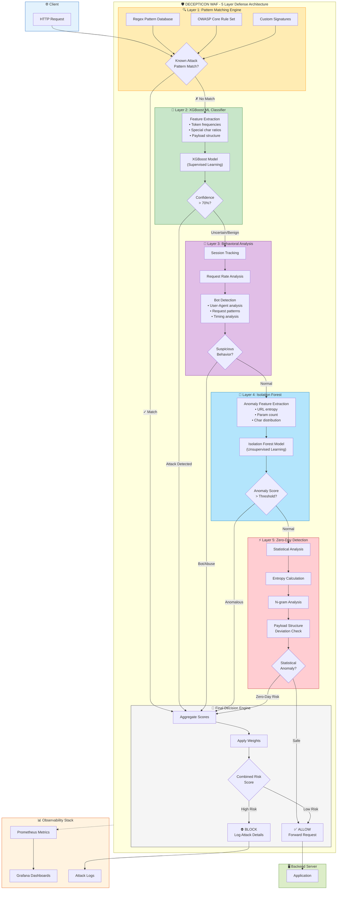
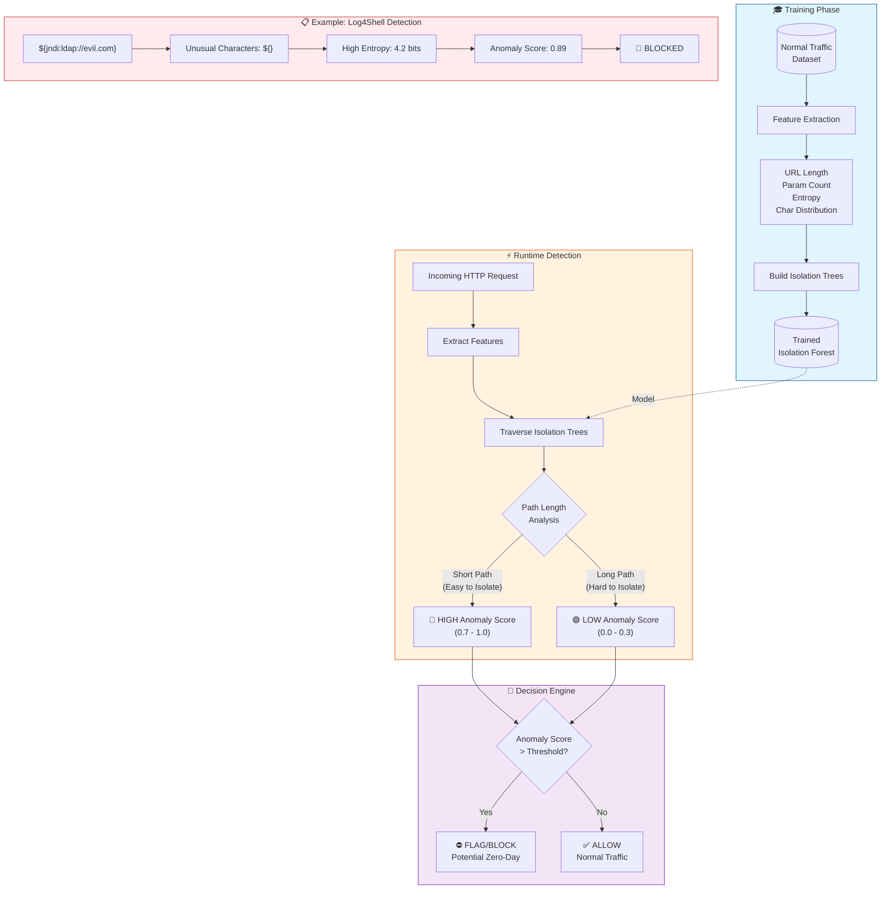
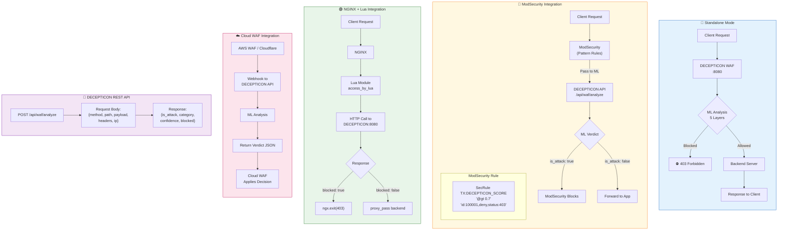

# DECEPTICON WAF - 5-Minute Video Demo Script

## 🎬 Video Overview

**Total Duration:** 5 minutes  
**Target Audience:** Security professionals, DevOps engineers, thesis reviewers  
**Prerequisites:** Docker running, dashboards pre-filled with data

---

## ⏱️ Timestamp Breakdown

| Time | Section | Duration |
|------|---------|----------|
| 0:00 - 0:45 | Introduction & Why DECEPTICON | 45 sec |
| 0:45 - 1:45 | Zero-Day Attack Handling | 60 sec |
| 1:45 - 2:15 | Open-Source WAF Integration | 30 sec |
| 2:15 - 3:15 | Docker Demo & Dashboard Tour | 60 sec |
| 3:15 - 3:45 | Data Flow & Environment Config | 30 sec |
| 3:45 - 4:15 | Feedback & Retraining Process | 30 sec |
| 4:15 - 5:00 | ML Models, Datasets & Future MLOps | 45 sec |

---

## 📝 FULL SCRIPT

---

### [0:00 - 0:45] Introduction & Why DECEPTICON is Better

**[SHOW: Terminal with project folder]**

> "Hi, I'm presenting DECEPTICON - a Machine Learning-powered Web Application Firewall that goes beyond traditional WAFs."

**[SHOW: Slide or diagram comparing Traditional vs ML WAF]**

> "Traditional WAFs like ModSecurity rely purely on **regex pattern matching** - they can only detect attacks they've seen before. This creates three major problems:"

> "**One** - High false positives. Legitimate requests containing words like 'SELECT' get blocked."

> "**Two** - Easy bypass. Attackers use encoding, case variation, or comment insertion to evade patterns."

> "**Three** - Zero protection against zero-day attacks."

**[SHOW: DECEPTICON architecture diagram]**



> "DECEPTICON solves this with a **5-layer defense architecture**:"
> - "Layer 1: Fast pattern matching for known attacks"
> - "Layer 2: XGBoost ML classifier for obfuscated attacks"
> - "Layer 3: Behavioral analysis and bot detection"  
> - "Layer 4: Isolation Forest for anomaly detection"
> - "Layer 5: Zero-day detection using statistical analysis"

> "The ML models provide **context-aware detection** - they understand attack semantics, not just patterns."

---

### [0:45 - 1:45] Zero-Day Attack Handling (60 seconds)

**[SHOW: Security Metrics Dashboard - Zero-Day panel]**

> "Let me explain how DECEPTICON handles zero-day attacks - threats that have never been seen before."

> "Traditional WAFs are **completely blind** to zero-days because their signature databases don't include them. By the time a signature is added, the damage is done."

**[SHOW: Diagram of Isolation Forest]**



> "DECEPTICON uses an **Isolation Forest algorithm** - an unsupervised machine learning model trained on normal traffic patterns."

> "Here's how it works:"

> "**Step 1**: During training, the model learns what 'normal' HTTP requests look like - typical URL lengths, parameter counts, character distributions, and entropy levels."

> "**Step 2**: At runtime, every request is scored based on how **anomalous** it is. The Isolation Forest assigns an anomaly score between 0 and 1."

> "**Step 3**: Requests with high anomaly scores - even if they don't match any known attack pattern - are flagged for review or blocked."

**[SHOW: Anomaly Score Histogram in Grafana]**

> "For example, when Log4Shell emerged in 2021, the `${jndi:ldap}` payload had **unusual character patterns** and **high entropy**. Our anomaly detector would flag it immediately - without any signature update."

> "This gives us **proactive protection** against novel attack vectors, supply chain attacks, and APT techniques."

---

### [1:45 - 2:15] Open-Source WAF Integration (30 seconds)

**[SHOW: Integration diagram]**



> "DECEPTICON isn't meant to replace existing WAFs - it **enhances** them."

> "It can integrate with:"
> - "**ModSecurity** - as a pre-filter or post-analysis layer"
> - "**NGINX** - using the Lua module for inline analysis"
> - "**Apache** - via mod_proxy for request inspection"
> - "**Cloud WAFs** - AWS WAF, Cloudflare, through API webhooks"

> "The integration is simple - DECEPTICON exposes a REST API at `/api/waf/analyze`. Your existing WAF sends requests here, gets ML verdicts, and can make smarter blocking decisions."

> "This means you get **ML intelligence without replacing your infrastructure**."

---

### [2:15 - 3:15] Docker Demo & Dashboard Tour (60 seconds)

**[SHOW: Terminal]**

> "Let me show you DECEPTICON in action. Everything runs in Docker."

```powershell
# Show running containers
docker-compose ps
```

> "We have four services: the WAF engine, Redis for session storage, Prometheus for metrics, and Grafana for visualization."

```powershell
# Health check
curl http://localhost:8080/health
```

> "The WAF is healthy. Let me send some attacks."

```powershell
# SQL Injection attack
curl -X POST "http://localhost:8080/api/waf/analyze" -H "Content-Type: application/json" -d "{\"method\":\"GET\",\"path\":\"/api/users\",\"payload\":\"1 OR 1=1--\"}"
```

> "Blocked! The response shows: attack category SQL Injection, confidence 97%, blocked true."

**[SWITCH TO: Grafana - http://localhost:3000]**

> "Now let's see the dashboards."

**[SHOW: WAF Overview Dashboard]**

> "Dashboard 1 - **Security Overview**: Shows real-time requests per second, attack categories distribution, ML prediction latency under 5 milliseconds, and overall security score."

**[SHOW: Security Metrics Dashboard]**

> "Dashboard 2 - **Security Metrics**: Deep dive into threat intelligence - attack timeline, severity distribution, anomaly scores, zero-day detections, and bot traffic analysis."

**[SHOW: ML Performance Dashboard]**

> "Dashboard 3 - **ML Performance**: Model health monitoring - prediction accuracy at 96%, confidence score distributions, false positive/negative tracking, and latency heatmaps."

---

### [3:15 - 3:45] Data Flow & Environment Configuration (30 seconds)

**[SHOW: .env file]**

> "Let me explain the data flow and security configuration."

> "Requests flow through: **WAF Engine → Prometheus scrapes /metrics → Grafana queries Prometheus**"

> "In the environment file, every secret serves a purpose:"

> - "`REDIS_PASSWORD` - Protects session storage from unauthorized access"
> - "`SESSION_ENCRYPTION_KEY` - AES-256 encryption for session data at rest"
> - "`DECEPTICON_ADMIN_KEY_HASH` - SHA-256 hashed admin API key for secure management"
> - "`GRAFANA_PASSWORD` - Dashboard access control"
> - "`MODEL_SIGNING_KEY` - Cryptographic verification that ML models haven't been tampered with"

> "All secrets are generated using Python's cryptographically secure `secrets` module - never hardcoded."

---

### [3:45 - 4:15] Feedback & Retraining Process (30 seconds)

**[SHOW: Admin Feedback diagram or API]**

> "DECEPTICON implements **continuous learning** through an admin feedback loop."

> "When a security analyst identifies a false positive or false negative, they submit feedback via the API:"

```bash
POST /api/admin/feedback
{
  "request_id": "abc123",
  "actual_label": "benign",
  "feedback": "false_positive"
}
```

> "This feedback is stored and used for **model retraining**. The adaptive learning system:"

> 1. "Collects feedback samples"
> 2. "Validates against ground truth"
> 3. "Triggers retraining when accuracy drops below threshold"
> 4. "Performs A/B testing before promoting new models"

> "This creates a **self-improving system** that gets better over time with real-world data."

---

### [4:15 - 5:00] ML Models, Datasets & Future MLOps (45 seconds)

**[SHOW: Model architecture slide]**

> "Let me explain the ML choices we made."

> "**Why XGBoost for classification?**"
> - "Handles imbalanced data well - attacks are rare compared to normal traffic"
> - "Interpretable feature importance - we can explain why something was blocked"
> - "Fast inference - under 5ms per request"
> - "Robust against overfitting with proper regularization"

> "**Why Isolation Forest for anomaly detection?**"
> - "Unsupervised - doesn't need labeled attack data"
> - "Efficient on high-dimensional data"
> - "Perfect for zero-day detection where we don't know what attacks look like"

> "**Training Datasets:**"
> - "CSIC 2010 HTTP Dataset - 36,000 normal and 25,000 attack requests"
> - "Custom-generated payloads from OWASP testing guides"
> - "Real-world sanitized logs for behavioral patterns"

**[SHOW: MLOps Pipeline diagram]**

> "**Future Roadmap - MLOps Automation:**"

> "We're building an automated data pipeline that will:"
> - "Scrape **CVE databases** daily for new vulnerability patterns"
> - "Pull payloads from **ExploitDB** and **PacketStorm**"
> - "Auto-generate training samples from new attack signatures"
> - "Trigger model retraining with CI/CD pipelines"
> - "Deploy updated models with zero downtime using blue-green deployment"

> "This transforms DECEPTICON from a static tool into a **living defense system** that evolves with the threat landscape."

---

### [5:00] Closing

> "That's DECEPTICON - an ML-powered WAF that provides intelligent, adaptive protection against both known and unknown threats."

> "Thank you for watching."

---

## 🎬 RECORDING CHECKLIST

### Pre-Recording Setup (10 min before):

```powershell
# 1. Start containers
docker-compose up -d

# 2. Wait for health
Start-Sleep 30

# 3. Fill dashboards (run the ALL-IN-ONE script from VIDEO_DEMO_COMMANDS.md)
# This takes ~2-3 minutes

# 4. Verify
curl http://localhost:8080/health
docker-compose ps
```

### Open These Windows:
- [ ] Terminal (PowerShell) - for commands
- [ ] VS Code with .env file open
- [ ] Browser Tab 1: Grafana WAF Overview - http://localhost:3000/d/waf-overview
- [ ] Browser Tab 2: Grafana Security Metrics - http://localhost:3000/d/security-metrics  
- [ ] Browser Tab 3: Grafana ML Performance - http://localhost:3000/d/ml-performance
- [ ] Slides/Diagrams (optional)

### Grafana Settings:
- Time range: Last 15 minutes
- Refresh: 5 seconds
- Login: admin / (your GRAFANA_PASSWORD)

---

## 📊 COMMANDS TO RUN DURING VIDEO

### Health Check (2:15)
```powershell
docker-compose ps
curl.exe http://localhost:8080/health
```

### Attack Demo (2:30)
```powershell
# SQL Injection - BLOCKED
curl.exe -X POST "http://localhost:8080/api/waf/analyze" -H "Content-Type: application/json" -d "{\"method\":\"GET\",\"path\":\"/api/users\",\"payload\":\"1 OR 1=1--\"}"

# XSS - BLOCKED  
curl.exe -X POST "http://localhost:8080/api/waf/analyze" -H "Content-Type: application/json" -d "{\"method\":\"GET\",\"path\":\"/api/search\",\"payload\":\"<script>alert(1)</script>\"}"

# Normal Request - ALLOWED
curl.exe -X POST "http://localhost:8080/api/waf/analyze" -H "Content-Type: application/json" -d "{\"method\":\"GET\",\"path\":\"/api/products\",\"payload\":\"category=books\"}"
```

---

## 📋 KEY TALKING POINTS CHEAT SHEET

### Traditional WAF Problems:
- Regex-only = easy bypass
- High false positives
- No zero-day protection
- Static rules need constant updates

### DECEPTICON Advantages:
- 5-layer defense architecture
- ML-based context understanding
- Unsupervised anomaly detection
- Self-improving with feedback
- <5ms latency

### Zero-Day Handling:
- Isolation Forest (unsupervised)
- Learns "normal" patterns
- Flags statistical anomalies
- No signatures needed

### ML Model Choices:
- **XGBoost**: Fast, interpretable, handles imbalance
- **Isolation Forest**: Unsupervised, zero-day capable
- **ONNX format**: Cross-platform, optimized inference

### Datasets:
- CSIC 2010 (61,000 samples)
- OWASP payloads
- Custom-generated attacks

### Future MLOps:
- Auto-scrape CVE/ExploitDB
- CI/CD model retraining
- Blue-green deployment
- Continuous learning pipeline

---

## 🎯 PRESENTATION TIPS

1. **Speak slowly** - 5 minutes goes fast, but rushing sounds unprofessional
2. **Pause on dashboards** - Let viewers see the graphs
3. **Show real responses** - The JSON output proves it works
4. **Practice transitions** - Terminal → Browser → Terminal should be smooth
5. **Have backup commands** - In case of typos, have them ready to paste

---

*Good luck with your video! 🎬*
